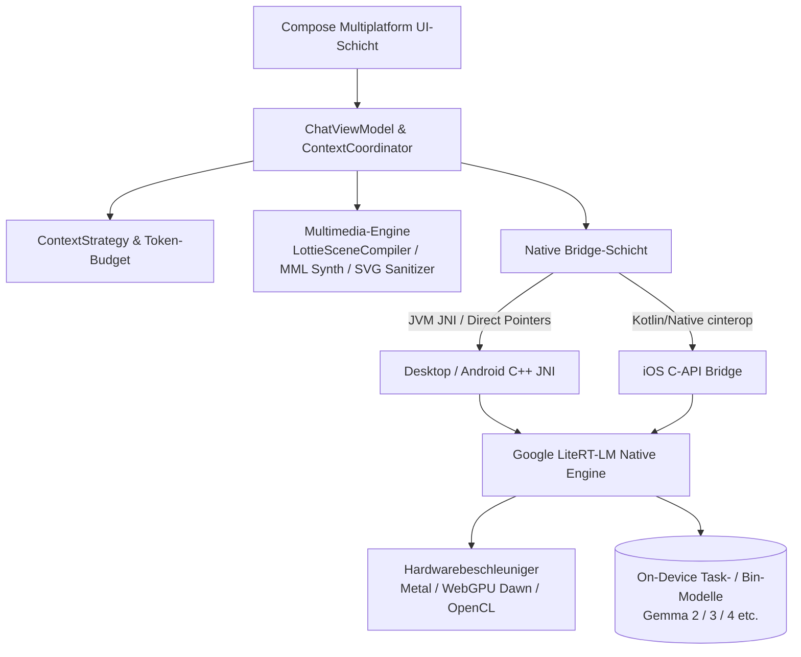

<p align="center">
  
</p>

<h1 align="center">Agro</h1>

<p align="center">
  <strong>Private. Lokal. Deins.</strong><br/>
  On-Device-Client der nächsten Generation für lokale LLMs und autonome Agenten, entwickelt mit Kotlin Multiplatform und Google LiteRT-LM
</p>

<p align="center">
  <a href="README.md">English</a> •
  <a href="README.zh-CN.md">简体中文</a> •
  <a href="README.zh-TW.md">繁體中文</a> •
  <a href="README.ja.md">日本語</a> •
  <a href="README.ko.md">한국어</a> •
  <a href="README.de.md"><b>Deutsch</b></a> •
  <a href="README.es.md">Español</a> •
  <a href="README.fr.md">Français</a> •
  <a href="README.ru.md">Русский</a>
</p>

<p align="center">
  <a href="https://github.com/Onion99/Agro/releases"></a>
  <a href="https://kotlinlang.org/"></a>
  <a href="https://www.jetbrains.com/lp/compose-multiplatform/"></a>
  <a href="https://ai.google.dev/edge/litert"></a>
  <a href="LICENSE"></a>
  <a href="https://github.com/Onion99/Agro"></a>
</p>

---

## 📖 Projektübersicht

**Agro** ist eine plattformübergreifende (Android, iOS, macOS, Windows, Linux), rein lokale **Chat- und autonome Agenten-Anwendung für Large Language Models (LLMs)**.

Im Gegensatz zu herkömmlichen KI-Tools, die auf externe Cloud-APIs angewiesen sind, führt Agro die gesamte Inferenz-Engine, Kontextplanung, Agenten-Werkzeugausführung und AIGC-Generierung direkt auf Ihrem physischen Endgerät aus. Angetrieben von Googles nativer C++-Laufzeitumgebung **LiteRT-LM** und nativer Hardwarebeschleunigung (Apple Metal, WebGPU Dawn, DirectX, Vulkan, OpenCL) garantiert Agro 100 % Datensouveränität und Privatsphäre bei herausragender Reaktionsgeschwindigkeit.

### 🌟 Wichtigste Highlights

- 🔒 **100 % Lokal & Offline-First**: Sämtliche Unterhaltungen, Verlaufsprotokolle und Inferenzberechnungen verbleiben ausnahmslos auf Ihrem Gerät – kein einziges Byte verlässt Ihr System.
- ⚡ **Native Hardwarebeschleunigung**: Low-Level-Speicherverwaltung und GPU-Optimierungen für Desktop-GPUs, Apple Neural Engine / Metal und mobile GPUs.
- 🧩 **Autonome Agenten & Werkzeug-Ökosystem**: Integrierter strukturierter Tool-Calling-Loop mit nativer JavaScript-Ausführung, Echtzeit-Websuche und URL-Inhaltsanalyse.
- 🎨 **Multimodale strukturierte Generierung**: Neben reinem Text rendert und synthetisiert Agro SVG-Vektorgrafiken, 8-Bit-Chiptune-Audiotracks und Lottie-Animationen in Echtzeit direkt auf dem Gerät.

---

## ✨ Kernfunktionen

| Funktion | Details zur Implementierung |
| --- | --- |
| **Lokale LLMs** | Lädt LiteRT-LM-kompatible `.litertlm`-Pakete. 1-Klick-Download für Ministral-3-3B & Gemma 4 4B mit Unterstützung für eigene benutzerdefinierte Modelle |
| **Streaming-Chat** | Inkrementelles Token-Streaming, Thinking-/Gedankenkanäle, Abbruch während der Generierung, automatischer CPU-Fallback bei GPU-Fehlern, Laufzeit-Telemetrie |
| **Kontextverwaltung** | Getrennte Kanäle für freie Konversation und strukturierte Synthese; liest native Token-Zahlen, verwaltet Token-Budgets, Verlaufswiedergabe und Kontext-Pruning |
| **Agent-Schleife** | Modell fordert Tool an → Host führt lokal aus → Strukturierte Rückmeldung → Fortgesetzte Inferenz (standardmäßig bis zu 10 Iterationen) |
| **Web-Werkzeuge** | Vorinstallierte Tools: `searchWeb` (Bing-Suche) und `analyzeUrl` (HTTP/HTTPS-Inhaltsabruf und -Extraktion) |
| **Kreativ-Modi** | 4 dedizierte Sitzungsprotokolle: Standard-Assistent, SVG-Vektorkunst, 8-Bit-BGM-Komponist und Lottie-Mikroanimationen |
| **Lokale Persistenz** | Room KMP + Bundled SQLite; sichert Sitzungen, Nachrichten, Tool-Logs und System-Prompt-Snapshots absolut verlässlich lokal |
| **Modellparameter** | Präzise Steuerung von Temperatur, Top-P, Top-K, Kontextfenster-Limits, Thinking-Modus, spekulativem Decoding und eigenen System-Prompts |

---

## 📱 Benutzeroberfläche

### Desktop-Ansicht
| Chat-Oberfläche | Startbildschirm |
| :---: | :---: |
|  |  |
| **Ressourcenbibliothek** | **Einstellungsbereich** |
|  |  |

### Mobile Ansicht
| Mobiler Chat | Mobile Startseite | Mobile Bibliothek | Mobile Einstellungen |
| :---: | :---: | :---: | :---: |
|  |  |  |  |

---

## 📦 Downloads & Plattformunterstützung

Vorkompilierte Veröffentlichungen stehen direkt auf der [Releases-Seite](https://github.com/Onion99/Agro/releases) bereit:

| Betriebssystem | Format | Download | Installations- und Laufzeithinweise |
| :--- | :--- | :--- | :--- |
| **Android** | `apk` | [Agro-Android.apk](https://github.com/Onion99/Agro/releases) | Erfordert Android 10.0+ (API 29+); ARM64-Geräte empfohlen |
| **iOS** | `ipa` | [Agro-iOS.ipa](https://github.com/Onion99/Agro/releases) | Erfordert iOS 16.0+; Sideloading über AltStore / TrollStore / Xcode |
| **Windows** | `exe` / `msi` / `zip` | [Agro-Windows-x86_64.zip](https://github.com/Onion99/Agro/releases) | Windows 10/11 x86_64 empfohlen; inklusive DirectX/WebGPU-Laufzeitdateien |
| **macOS** | `dmg` | [Agro-macOS-arm64.dmg](https://github.com/Onion99/Agro/releases) | Nativ für Apple Silicon (M1/M2/M3/M4). Bei Gatekeeper-Meldung ausführen:<br/>`sudo xattr -d com.apple.quarantine /Applications/Agro.app` |
| **Linux** | `AppImage` / `deb` / `rpm` | [Agro-Linux-x86_64.AppImage](https://github.com/Onion99/Agro/releases) | Unterstützt gängige x86_64-Distributionen (Ubuntu, Fedora, Arch etc.) |

---

## 🏗️ Systemarchitektur & modulares Design

Agro folgt konsequent den Prinzipien von **Kotlin Multiplatform (KMP) + Clean Architecture / MVVM**:



### 📁 Verzeichnis- und Modulstruktur

```
Agro/
├── composeApp/            # Hauptanwendung, Compose Multiplatform UI, ViewModel, AIGC-Compiler und JNI-Bridges
│   └── src/
│       ├── commonMain/    # Geteilte UI (Screens, Theme, Komponenten, Navigation) & Geschäftslogik
│       ├── androidMain/   # Android-spezifische Konfigurationen, Activities & JNI-Bindings
│       ├── desktopMain/   # Desktop-JVM-Integration, nativer Bibliotheksentpacker & Fensterverwaltung
│       └── iosMain/       # iOS-cinterop, AVAudioPlayer & native Bridge
├── shared/                # Plattformübergreifende Geschäftslogik & Core Coordinators
├── ui-theme/              # Ethereal Minimalism Design-Tokens (Farben, Typografie, Formen, Abstände)
├── data-network/          # Ktor 3.x Netzwerk-Client & Sandwich Response-Modelle
├── data-model/            # Reine Kotlin-Domänenmodelle & Serialisierungs-Schemas
└── cpp/                   # Natives C++-Projekt & vorkompilierte LiteRT-LM-Laufzeitbibliotheken
    └── lite-rt-lm/        # Google AI Edge LiteRT-LM Quellcode, C-API-Header & Bazel-Build-Konfigurationen
```

---

## 🛠️ Technologie-Stack & Abhängigkeiten

- **Sprache & Plattform**: Kotlin `2.4.0`, Kotlin Multiplatform, Kotlinx Coroutines `1.10.2`, Kotlinx Serialization `1.8.0`
- **UI-Framework**: Compose Multiplatform `1.11.1`, Material 3 Adaptive `1.1.2`, Compose Rich Editor `1.0.0-rc14`
- **Animationen & Multimedia**: Compottie `2.0.0-rc04` (Lottie), ComposeMediaPlayer `0.11.3`, Coil 3 `3.5.0` (SVG-Unterstützung)
- **Dependency Injection & Architektur**: Koin `4.1.1` (Core, Compose, ViewModel), AndroidX Lifecycle ViewModel `2.9.6`, Navigation 3 UI
- **Lokale Speicherung**: AndroidX Room `2.8.4` (KMP), SQLite Bundled `2.6.2`, Okio `3.15.0`, FileKit `0.14.2`
- **Netzwerk & Parser**: Ktor `3.2.3`, Sandwich `2.1.2`, Ksoup `0.2.6`, QuickJS-kt `1.0.0-alpha13`
- **Low-Level KI-Engine**: Google LiteRT-LM (C++ Runtime), Beschleunigung via Metal / WebGPU Dawn / OpenCL / Vulkan, Bazel

---

## 🚀 Entwicklung & Build-Anleitung

### 1. Voraussetzungen
- **JDK**: Java 21 (Empfohlen: [JetBrains Runtime 21](https://github.com/JetBrains/JetBrainsRuntime) oder Eclipse Temurin 21)
- **Android-Entwicklung**: Android Studio Ladybug+, Android SDK 36, Android NDK `27.0.12077973`
- **iOS / macOS-Entwicklung**: macOS-Umgebung, Xcode 15+, Command Line Tools
- **Bazelisk**: Installieren Sie [Bazelisk](https://github.com/bazelbuild/bazelisk) zum Erstellen von LiteRT-LM C++-Abhängigkeiten
- **Git LFS**: Vor dem Klonen sicherstellen, dass Git LFS installiert ist:
  ```bash
  git lfs install
  ```

### 2. Repository klonen
```bash
# Repository samt Submodulen klonen
git clone --recursive https://github.com/Onion99/Agro.git
cd Agro

# Binäre Assets via Git LFS abrufen
git lfs install
git lfs pull
```

### 3. Anwendung starten

#### 🖥️ Desktop (JVM)
```bash
./gradlew :composeApp:run
```

#### 🤖 Android
Android-Gerät anschließen oder Emulator starten, dann ausführen:
```bash
./gradlew :composeApp:installDebug
```

#### 🍏 iOS
Projektdatei `iosApp/iosApp.xcworkspace` in Xcode öffnen, Target/Simulator für Code Signing auswählen oder das Framework über Gradle bauen:
```bash
./gradlew :composeApp:embedAndSignAppleFrameworkForXcode
```

### 4. Tests ausführen
```bash
# Unit-Tests und Desktop-Tests ausführen
./gradlew :composeApp:desktopTest
./gradlew :composeApp:allTests
```

### 5. Distribution paketieren
```bash
# Installationspaket für das aktuelle Betriebssystem erstellen (msi / dmg / deb / rpm)
./gradlew :composeApp:packageDistributionForCurrentOS

# Android Release-APK erstellen
./gradlew :composeApp:assembleRelease
```

---

## 📄 Lizenz & Danksagung

- Dieses Projekt ist unter der **[GNU General Public License v3.0 (GPL-3.0)](LICENSE)** lizenziert.
- Besonderer Dank gilt folgenden Open-Source-Projekten und Communities:
    - [Google LiteRT-LM (LiteRT)](https://ai.google.dev/edge/litert) — Ultraschneller On-Device Inferenzkern
    - [JetBrains Compose Multiplatform](https://www.jetbrains.com/lp/compose-multiplatform/) — Deklaratives plattformübergreifendes UI-Framework
    - [Compottie](https://github.com/alexzhirkevich/compottie) — Lottie-Renderer für Compose Multiplatform
    - [ComposeMediaPlayer](https://github.com/kdroidFilter/ComposeMediaPlayer) — Schlanker Cross-Platform Media Player
    - [Compose Rich Editor](https://github.com/MohamedRejeb/Compose-Rich-Editor) — Rich-Text-Editor für Compose Multiplatform
    - [QuickJS-kt](https://github.com/dokar3/quickjs-kt) — Eingebettete Kotlin JavaScript Engine
    - [Coil](https://github.com/coil-kt/coil) — Asynchrones Laden von Bildern in Kotlin
    - [Koin](https://insert-koin.io/) & [Ktor](https://ktor.io/) — Modernes DI- und asynchrones Netzwerk-Framework

---

<p align="center">
  Entwickelt mit 💚 von <strong>Onion99</strong> und der Open-Source-Community
</p>
