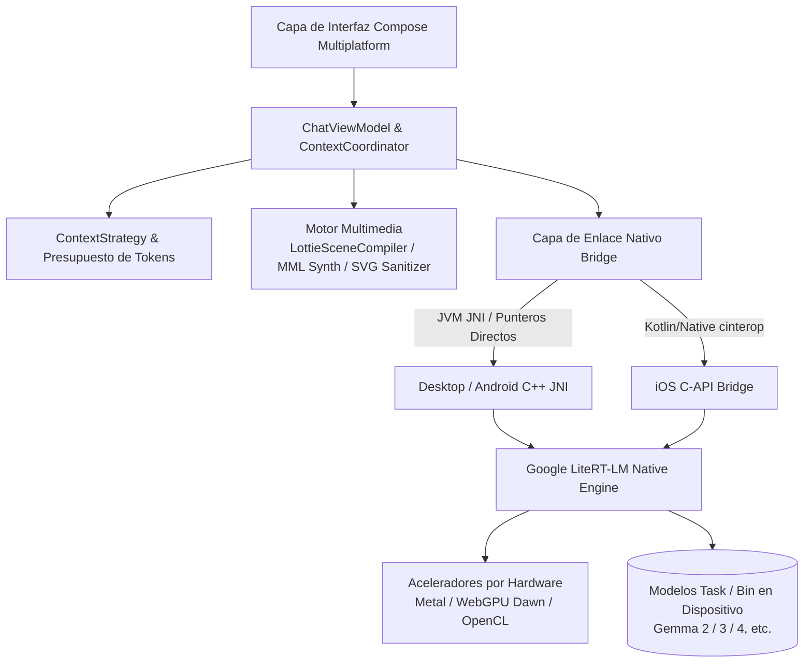

<p align="center">
  
</p>

<h1 align="center">Agro</h1>

<p align="center">
  <strong>Privado. Local. Tuyo.</strong><br/>
  Cliente local de LLM y agentes autónomos en el dispositivo de última generación, creado con Kotlin Multiplatform y Google LiteRT-LM
</p>

<p align="center">
  <a href="README.md">English</a> •
  <a href="README.zh-CN.md">简体中文</a> •
  <a href="README.zh-TW.md">繁體中文</a> •
  <a href="README.ja.md">日本語</a> •
  <a href="README.ko.md">한국어</a> •
  <a href="README.de.md">Deutsch</a> •
  <a href="README.es.md"><b>Español</b></a> •
  <a href="README.fr.md">Français</a> •
  <a href="README.ru.md">Русский</a>
</p>

<p align="center">
  <a href="https://github.com/Onion99/Agro/releases"></a>
  <a href="https://kotlinlang.org/"></a>
  <a href="https://www.jetbrains.com/lp/compose-multiplatform/"></a>
  <a href="https://ai.google.dev/edge/litert"></a>
  <a href="LICENSE"></a>
  <a href="https://github.com/Onion99/Agro"></a>
</p>

---

## 📖 Descripción General

**Agro** es una aplicación multiplataforma (Android, iOS, macOS, Windows, Linux) de **chat con modelos de lenguaje grandes (LLM) y agentes autónomos que se ejecuta 100% de manera local en tu dispositivo**.

A diferencia de las herramientas convencionales de IA que dependen de APIs en la nube, Agro ejecuta todo el motor de inferencia, la gestión de contexto, la ejecución de herramientas de agentes y el renderizado AIGC directamente en tu hardware. Impulsado por el motor nativo en C++ **LiteRT-LM** de Google y aceleración por hardware (Apple Metal, WebGPU Dawn, DirectX, Vulkan, OpenCL), Agro garantiza la soberanía total y privacidad de tus datos mientras ofrece una experiencia de generación fluida e instantánea.

### 🌟 Puntos Destacados

- 🔒 **100% Local y con Prioridad Fuera de Línea (Offline-First)**: Todas las conversaciones, registros históricos y cálculos de inferencia permanecen exclusivamente en tu dispositivo, sin enviar un solo byte a la nube.
- ⚡ **Aceleración por Hardware Nativa**: Gestión de memoria de bajo nivel y optimizaciones para GPUs de escritorio, Apple Neural Engine / Metal y GPUs móviles.
- 🧩 **Agentes Autónomos y Ecosistema de Herramientas**: Bucle estructurado de llamada a funciones (Tool Calling) con ejecución local de JavaScript, búsqueda web en tiempo real y análisis de contenidos URL.
- 🎨 **Generación Estructurada Multimodal**: Más allá de texto simple, sintetiza y renderiza gráficos vectoriales SVG, pistas de audio chiptune de 8 bits y animaciones Lottie en tiempo real directamente en el dispositivo.

---

## ✨ Capacidades Principales

| Capacidad | Detalles de Implementación |
| --- | --- |
| **LLMs Locales** | Compatible con paquetes `.litertlm` de LiteRT-LM. Descargas con un clic para Ministral-3-3B y Gemma 4 4B, con soporte para modelos personalizados |
| **Chat en Streaming** | Generación incremental de tokens, canales de razonamiento/pensamiento (Thinking), cancelación en tiempo real, cambio automático a CPU en caso de error de GPU y telemetría |
| **Gestión de Contexto** | Canales independientes para conversación libre y síntesis estructurada; cálculo de tokens nativos, estimación de presupuesto, reproducción de historial y poda de contexto |
| **Bucle de Agentes** | Solicitud de herramienta por el modelo → Ejecución local en el host → Respuesta estructurada → Inferencia continua (hasta 10 iteraciones por defecto) |
| **Herramientas Web** | Herramientas integradas: `searchWeb` (búsqueda en Bing) y `analyzeUrl` (captura y análisis de contenido web HTTP/HTTPS) |
| **Modos Creativos** | 4 protocolos de sesión dedicados: Asistente Estándar, Gráficos Vectoriales SVG, Compositor BGM 8-bit y Animaciones Lottie |
| **Persistencia Local** | Room KMP + SQLite empaquetado; almacena de forma segura conversaciones, mensajes, registros de herramientas y directivas del sistema |
| **Parámetros del Modelo** | Control detallado sobre Temperatura, Top-P, Top-K, límites de ventana de contexto, modo Thinking, Speculative Decoding y Prompts del Sistema personalizados |

---

## 📱 Demostración de Interfaz

### Versión de Escritorio
| Interfaz de Chat | Pantalla Principal |
| :---: | :---: |
|  |  |
| **Biblioteca de Recursos** | **Panel de Configuración** |
|  |  |

### Versión Móvil
| Chat Móvil | Inicio Móvil | Biblioteca Móvil | Ajustes Móviles |
| :---: | :---: | :---: | :---: |
|  |  |  |  |

---

## 📦 Descargas y Plataformas Compatibles

Descarga los binarios precompilados directamente desde la [Página de Releases](https://github.com/Onion99/Agro/releases):

| Sistema Operativo | Formato de Distribución | Enlace de Descarga | Notas de Instalación y Ejecución |
| :--- | :--- | :--- | :--- |
| **Android** | `apk` | [Agro-Android.apk](https://github.com/Onion99/Agro/releases) | Requiere Android 10.0+ (API 29+); se recomiendan dispositivos ARM64 |
| **iOS** | `ipa` | [Agro-iOS.ipa](https://github.com/Onion99/Agro/releases) | Requiere iOS 16.0+; instalación mediante AltStore / TrollStore / Xcode |
| **Windows** | `exe` / `msi` / `zip` | [Agro-Windows-x86_64.zip](https://github.com/Onion99/Agro/releases) | Recomendado Windows 10/11 x86_64; incluye runtimes DirectX/WebGPU |
| **macOS** | `dmg` | [Agro-macOS-arm64.dmg](https://github.com/Onion99/Agro/releases) | Nativo para Apple Silicon (M1/M2/M3/M4). Si Gatekeeper bloquea la app, ejecuta:<br/>`sudo xattr -d com.apple.quarantine /Applications/Agro.app` |
| **Linux** | `AppImage` / `deb` / `rpm` | [Agro-Linux-x86_64.AppImage](https://github.com/Onion99/Agro/releases) | Compatible con las principales distribuciones x86_64 (Ubuntu, Fedora, Arch, etc.) |

---

## 🏗️ Arquitectura del Sistema y Diseño Modular

Agro sigue los principios de **Kotlin Multiplatform (KMP) + Clean Architecture / MVVM**:



### 📁 Estructura de Módulos y Directorios

```
Agro/
├── composeApp/            # Entrada principal, interfaz Compose Multiplatform, ViewModel, compiladores AIGC y enlaces JNI
│   └── src/
│       ├── commonMain/    # Interfaz compartida (Pantallas, Tema, Componentes, Navegación) y lógica de negocio
│       ├── androidMain/   # Configuraciones nativas de Android, Activities y enlaces JNI
│       ├── desktopMain/   # Integración JVM de escritorio, descompresor de librerías nativas y ventanas
│       └── iosMain/       # cinterop de iOS, AVAudioPlayer y enlace nativo
├── shared/                # Lógica de negocio compartida multiplataforma y coordinadores centrales
├── ui-theme/              # Tokens de diseño de Ethereal Minimalism (Color, Tipografía, Formas, Espaciado)
├── data-network/          # Cliente de red Ktor 3.x y modelos de respuesta Sandwich
├── data-model/            # Modelos de dominio y esquemas de serialización en Kotlin puro
└── cpp/                   # Espacio de trabajo C++ nativo y librerías precompiladas de LiteRT-LM
    └── lite-rt-lm/        # Código fuente de Google AI Edge LiteRT-LM, cabeceras C-API y esquemas de Bazel
```

---

## 🛠️ Stack Tecnológico y Dependencias

- **Lenguaje y Plataforma Central**: Kotlin `2.4.0`, Kotlin Multiplatform, Kotlinx Coroutines `1.10.2`, Kotlinx Serialization `1.8.0`
- **Framework de UI**: Compose Multiplatform `1.11.1`, Material 3 Adaptive `1.1.2`, Compose Rich Editor `1.0.0-rc14`
- **Animaciones y Multimedia**: Compottie `2.0.0-rc04` (Lottie), ComposeMediaPlayer `0.11.3`, Coil 3 `3.5.0` (soporte SVG)
- **Inyección de Dependencias y Arquitectura**: Koin `4.1.1` (Core, Compose, ViewModel), AndroidX Lifecycle ViewModel `2.9.6`, Navigation 3 UI
- **Almacenamiento Local**: AndroidX Room `2.8.4` (KMP), SQLite Bundled `2.6.2`, Okio `3.15.0`, FileKit `0.14.2`
- **Red y Analizadores**: Ktor `3.2.3`, Sandwich `2.1.2`, Ksoup `0.2.6`, QuickJS-kt `1.0.0-alpha13`
- **Motor de IA de Bajo Nivel**: Google LiteRT-LM (C++ Runtime), aceleración con Metal / WebGPU Dawn / OpenCL / Vulkan, Bazel

---

## 🚀 Guía de Desarrollo y Compilación

### 1. Requisitos Previos
- **JDK**: Java 21 (Se recomienda [JetBrains Runtime 21](https://github.com/JetBrains/JetBrainsRuntime) o Eclipse Temurin 21)
- **Desarrollo Android**: Android Studio Ladybug+, Android SDK 36, Android NDK `27.0.12077973`
- **Desarrollo iOS / macOS**: Entorno macOS, Xcode 15+, Command Line Tools
- **Bazelisk**: Instalar [Bazelisk](https://github.com/bazelbuild/bazelisk) para compilar dependencias C++ de LiteRT-LM
- **Git LFS**: Asegúrate de tener Git LFS instalado antes de clonar:
  ```bash
  git lfs install
  ```

### 2. Clonar Repositorio
```bash
# Clonar repositorio y submódulos
git clone --recursive https://github.com/Onion99/Agro.git
cd Agro

# Descargar archivos binarios mediante Git LFS
git lfs install
git lfs pull
```

### 3. Ejecutar la Aplicación

#### 🖥️ Escritorio (JVM)
```bash
./gradlew :composeApp:run
```

#### 🤖 Android
Conecta tu dispositivo Android o inicia un emulador y ejecuta:
```bash
./gradlew :composeApp:installDebug
```

#### 🍏 iOS
Abre `iosApp/iosApp.xcworkspace` en Xcode, selecciona el Target/Simulador para firma y ejecución, o compila el framework mediante Gradle:
```bash
./gradlew :composeApp:embedAndSignAppleFrameworkForXcode
```

### 4. Ejecutar Pruebas
```bash
# Ejecutar pruebas unitarias comunes y de escritorio
./gradlew :composeApp:desktopTest
./gradlew :composeApp:allTests
```

### 5. Empaquetado para Distribución
```bash
# Empaquetar binarios de distribución de escritorio para el SO actual (msi / dmg / deb / rpm)
./gradlew :composeApp:packageDistributionForCurrentOS

# Compilar APK de lanzamiento para Android
./gradlew :composeApp:assembleRelease
```

---

## 📄 Licencia y Agradecimientos

- Este proyecto está licenciado bajo la **[GNU General Public License v3.0 (GPL-3.0)](LICENSE)**.
- Agradecimientos especiales a los siguientes proyectos de código abierto y comunidades:
    - [Google LiteRT-LM (LiteRT)](https://ai.google.dev/edge/litert) — Núcleo de inferencia ultrarrápido en el dispositivo
    - [JetBrains Compose Multiplatform](https://www.jetbrains.com/lp/compose-multiplatform/) — Framework declarativo de interfaz multiplataforma
    - [Compottie](https://github.com/alexzhirkevich/compottie) — Renderizador Lottie para Compose Multiplatform
    - [ComposeMediaPlayer](https://github.com/kdroidFilter/ComposeMediaPlayer) — Reproductor multimedia ligero multiplataforma
    - [Compose Rich Editor](https://github.com/MohamedRejeb/Compose-Rich-Editor) — Editor de texto enriquecido
    - [QuickJS-kt](https://github.com/dokar3/quickjs-kt) — Motor JavaScript embebido para Kotlin
    - [Coil](https://github.com/coil-kt/coil) — Carga asíncrona de imágenes en Kotlin
    - [Koin](https://insert-koin.io/) & [Ktor](https://ktor.io/) — Stack moderno de inyección de dependencias y red

---

<p align="center">
  Hecho con 💚 por <strong>Onion99</strong> y la comunidad de código abierto
</p>
