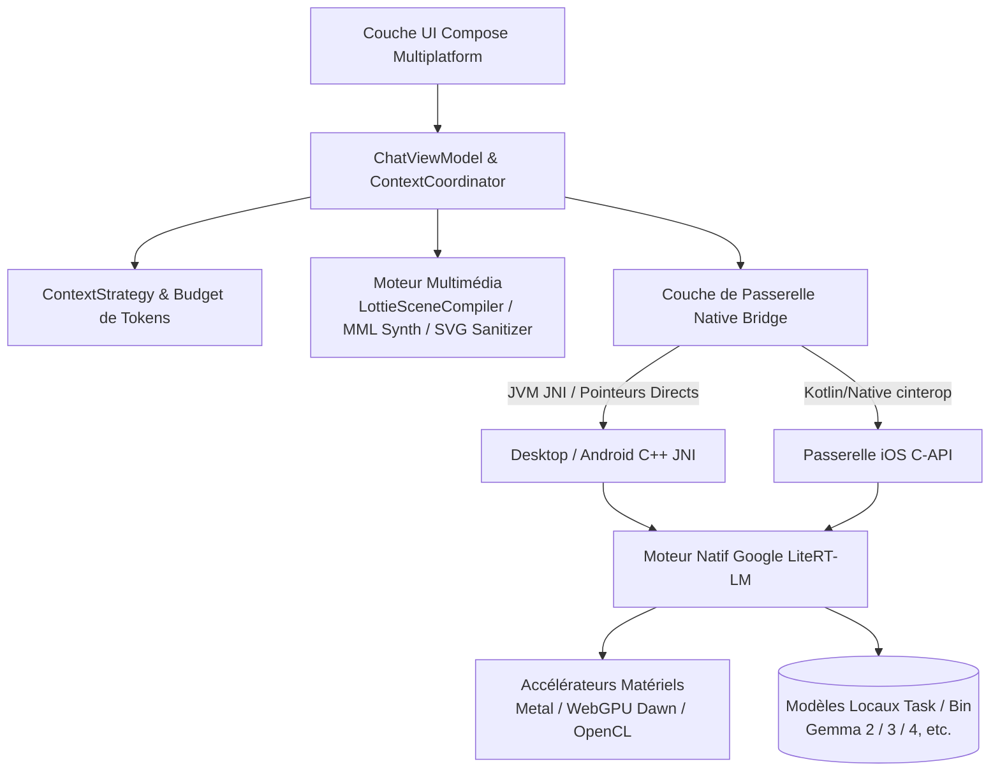

<p align="center">
  
</p>

<h1 align="center">Agro</h1>

<p align="center">
  <strong>Privé. Local. À vous.</strong><br/>
  Client LLM et agents autonomes on-device de nouvelle génération, développé avec Kotlin Multiplatform et Google LiteRT-LM
</p>

<p align="center">
  <a href="README.md">English</a> •
  <a href="README.zh-CN.md">简体中文</a> •
  <a href="README.zh-TW.md">繁體中文</a> •
  <a href="README.ja.md">日本語</a> •
  <a href="README.ko.md">한국어</a> •
  <a href="README.de.md">Deutsch</a> •
  <a href="README.es.md">Español</a> •
  <a href="README.fr.md"><b>Français</b></a> •
  <a href="README.ru.md">Русский</a>
</p>

<p align="center">
  <a href="https://github.com/Onion99/Agro/releases"></a>
  <a href="https://kotlinlang.org/"></a>
  <a href="https://www.jetbrains.com/lp/compose-multiplatform/"></a>
  <a href="https://ai.google.dev/edge/litert"></a>
  <a href="LICENSE"></a>
  <a href="https://github.com/Onion99/Agro"></a>
</p>

---

## 📖 Présentation du Projet

**Agro** est une application multiplateforme (Android, iOS, macOS, Windows, Linux) de **chat avec des modèles de langage (LLM) et des agents autonomes fonctionnant à 100 % en local sur votre appareil**.

Contrairement aux outils d'IA conventionnels qui dépendent d'API cloud distantes, Agro intègre le moteur d'inférence complet, la gestion de contexte, l'exécution d'outils d'agents et le rendu AIGC directement sur votre matériel physique. Propulsé par le runtime natif C++ **LiteRT-LM** de Google et l'accélération matérielle (Apple Metal, WebGPU Dawn, DirectX, Vulkan, OpenCL), Agro garantit une souveraineté et une confidentialité totales de vos données tout en offrant une réactivité et une fluidité exemplaires.

### 🌟 Points Clés

- 🔒 **100 % Local & Offline-First** : Toutes les conversations, l'historique et les calculs d'inférence restent exclusivement sur votre appareil — aucun octet n'est envoyé dans le cloud.
- ⚡ **Accélération Matérielle Native** : Gestion mémoire de bas niveau et optimisations dédiées pour les GPU de bureau, l'Apple Neural Engine / Metal et les GPU mobiles.
- 🧩 **Agents Autonomes & Écosystème d'Outils** : Boucle structurée d'appel de fonctions (Tool Calling) avec exécution JavaScript locale, recherche web en temps réel et analyse de pages URL.
- 🎨 **Génération Structurée Multimodale** : Au-delà du texte brut, Agro génère et restitue en temps réel des graphismes vectoriels SVG, des bandes-son chiptune 8-bit et des micro-animations Lottie directement sur l'appareil.

---

## ✨ Fonctionnalités Principales

| Fonctionnalité | Détails de l'implémentation |
| --- | --- |
| **LLMs Locaux** | Prise en charge des bundles `.litertlm` compatibles LiteRT-LM. Téléchargement en un clic pour Ministral-3-3B et Gemma 4 4B, avec support de modèles personnalisés |
| **Chat en Streaming** | Flux continu de tokens, canaux de réflexion (Thinking), annulation en cours de génération, bascule automatique sur CPU en cas d'erreur GPU, télémétrie en temps réel |
| **Gestion du Contexte** | Séparation stricte des canaux de conversation libre et de synthèse structurée ; comptage précis des tokens natifs, budgétisation, rejeu d'historique et élagage de contexte |
| **Boucle d'Agent** | Requête d'outil par le modèle → Exécution locale sur l'hôte → Réponse structurée → Poursuite de l'inférence (jusqu'à 10 itérations par défaut) |
| **Outils Web Intégrés** | Outils préconfigurés : `searchWeb` (recherche Bing) et `analyzeUrl` (extraction et analyse de contenu web HTTP/HTTPS) |
| **Modes Créatifs** | 4 protocoles de session dédiés : Assistant Universel, Graphiques Vectoriels SVG, Compositeur BGM 8-bit et Micro-animations Lottie |
| **Persistance Locale** | Room KMP + SQLite embarqué ; sauvegarde sécurisée des sessions, messages, journaux d'outils et directives système |
| **Paramètres de Modèle** | Contrôle précis : Température, Top-P, Top-K, limites de contexte, mode Thinking, Speculative Decoding et prompts système personnalisés |

---

## 📱 Aperçu de l'Interface

### Version Bureau (Desktop)
| Interface de Chat | Écran d'accueil |
| :---: | :---: |
|  |  |
| **Bibliothèque de Ressources** | **Panneau de Configuration** |
|  |  |

### Version Mobile
| Chat Mobile | Accueil Mobile | Bibliothèque Mobile | Réglages Mobiles |
| :---: | :---: | :---: | :---: |
|  |  |  |  |

---

## 📦 Téléchargements et Plateformes

Les binaires précompilés sont disponibles directement sur la [page des versions (Releases)](https://github.com/Onion99/Agro/releases) :

| Système d'exploitation | Format | Téléchargement | Remarques d'installation et d'exécution |
| :--- | :--- | :--- | :--- |
| **Android** | `apk` | [Agro-Android.apk](https://github.com/Onion99/Agro/releases) | Nécessite Android 10.0+ (API 29+) ; appareils ARM64 recommandés |
| **iOS** | `ipa` | [Agro-iOS.ipa](https://github.com/Onion99/Agro/releases) | Nécessite iOS 16.0+ ; installation via AltStore / TrollStore / Xcode |
| **Windows** | `exe` / `msi` / `zip` | [Agro-Windows-x86_64.zip](https://github.com/Onion99/Agro/releases) | Windows 10/11 x86_64 recommandé ; inclut les runtimes DirectX/WebGPU |
| **macOS** | `dmg` | [Agro-macOS-arm64.dmg](https://github.com/Onion99/Agro/releases) | Natif pour Apple Silicon (M1/M2/M3/M4). En cas de blocage Gatekeeper :<br/>`sudo xattr -d com.apple.quarantine /Applications/Agro.app` |
| **Linux** | `AppImage` / `deb` / `rpm` | [Agro-Linux-x86_64.AppImage](https://github.com/Onion99/Agro/releases) | Compatible avec les principales distributions x86_64 (Ubuntu, Fedora, Arch, etc.) |

---

## 🏗️ Architecture Système & Conception Modulaire

Agro respecte rigoureusement les principes **Kotlin Multiplatform (KMP) + Clean Architecture / MVVM** :



### 📁 Structure des Dossiers et Modules

```
Agro/
├── composeApp/            # Point d'entrée, UI Compose Multiplatform, ViewModel, compilateurs AIGC et ponts JNI
│   └── src/
│       ├── commonMain/    # UI partagée (écrans, thème, composants, navigation) et logique métier
│       ├── androidMain/   # Configurations natives Android, Activités et liaisons JNI
│       ├── desktopMain/   # Intégration JVM bureau, décompresseur de bibliothèques natives et fenêtrage
│       └── iosMain/       # cinterop iOS, AVAudioPlayer et pont natif
├── shared/                # Logique métier partagée multiplateforme et coordinateurs centraux
├── ui-theme/              # Tokens du design system Ethereal Minimalism (Couleurs, Typographie, Formes, Espacements)
├── data-network/          # Client réseau Ktor 3.x et modèles de réponse Sandwich
├── data-model/            # Modèles de domaine et schémas de sérialisation en Kotlin pur
└── cpp/                   # Espace de travail natif C++ et bibliothèques précompilées LiteRT-LM
    └── lite-rt-lm/        # Code source Google AI Edge LiteRT-LM, en-têtes C-API et blueprints de build Bazel
```

---

## 🛠️ Stack Technologique & Dépendances

- **Langage & Plateforme** : Kotlin `2.4.0`, Kotlin Multiplatform, Kotlinx Coroutines `1.10.2`, Kotlinx Serialization `1.8.0`
- **Framework d'Interface** : Compose Multiplatform `1.11.1`, Material 3 Adaptive `1.1.2`, Compose Rich Editor `1.0.0-rc14`
- **Animations & Multimédia** : Compottie `2.0.0-rc04` (Lottie), ComposeMediaPlayer `0.11.3`, Coil 3 `3.5.0` (support SVG)
- **Injection de Dépendances & Architecture** : Koin `4.1.1` (Core, Compose, ViewModel), AndroidX Lifecycle ViewModel `2.9.6`, Navigation 3 UI
- **Stockage Local** : AndroidX Room `2.8.4` (KMP), SQLite Bundled `2.6.2`, Okio `3.15.0`, FileKit `0.14.2`
- **Réseau & Analyseurs** : Ktor `3.2.3`, Sandwich `2.1.2`, Ksoup `0.2.6`, QuickJS-kt `1.0.0-alpha13`
- **Moteur d'IA Bas Niveau** : Google LiteRT-LM (C++ Runtime), accélération Metal / WebGPU Dawn / OpenCL / Vulkan, Bazel

---

## 🚀 Guide de Développement & de Compilation

### 1. Prérequis
- **JDK** : Java 21 (Recommandé : [JetBrains Runtime 21](https://github.com/JetBrains/JetBrainsRuntime) ou Eclipse Temurin 21)
- **Développement Android** : Android Studio Ladybug+, Android SDK 36, Android NDK `27.0.12077973`
- **Développement iOS / macOS** : Environnement macOS, Xcode 15+, Command Line Tools
- **Bazelisk** : Installer [Bazelisk](https://github.com/bazelbuild/bazelisk) pour compiler les dépendances C++ de LiteRT-LM
- **Git LFS** : S'assurer que Git LFS est installé avant le clonage :
  ```bash
  git lfs install
  ```

### 2. Cloner le Dépôt
```bash
# Cloner le dépôt et ses sous-modules
git clone --recursive https://github.com/Onion99/Agro.git
cd Agro

# Récupérer les fichiers binaires Git LFS
git lfs install
git lfs pull
```

### 3. Lancer l'Application

#### 🖥️ Bureau (JVM)
```bash
./gradlew :composeApp:run
```

#### 🤖 Android
Connectez votre appareil Android ou lancez un émulateur, puis exécutez :
```bash
./gradlew :composeApp:installDebug
```

#### 🍏 iOS
Ouvrez `iosApp/iosApp.xcworkspace` dans Xcode, sélectionnez la cible/simulateur pour la signature et l'exécution, ou compilez le framework via Gradle :
```bash
./gradlew :composeApp:embedAndSignAppleFrameworkForXcode
```

### 4. Exécuter les Tests
```bash
# Exécuter les tests unitaires communs et bureau
./gradlew :composeApp:desktopTest
./gradlew :composeApp:allTests
```

### 5. Empaquetage pour Distribution
```bash
# Générer le package d'installation pour l'OS actuel (msi / dmg / deb / rpm)
./gradlew :composeApp:packageDistributionForCurrentOS

# Compiler l'APK de release pour Android
./gradlew :composeApp:assembleRelease
```

---

## 📄 Licence et Remerciements

- Ce projet est sous licence open source **[GNU General Public License v3.0 (GPL-3.0)](LICENSE)**.
- Nos sincères remerciements aux projets open source et communautés suivantes :
    - [Google LiteRT-LM (LiteRT)](https://ai.google.dev/edge/litert) — Moteur d'inférence on-device ultra-rapide
    - [JetBrains Compose Multiplatform](https://www.jetbrains.com/lp/compose-multiplatform/) — Framework UI déclaratif multiplateforme
    - [Compottie](https://github.com/alexzhirkevich/compottie) — Moteur de rendu Lottie pour Compose Multiplatform
    - [ComposeMediaPlayer](https://github.com/kdroidFilter/ComposeMediaPlayer) — Lecteur multimédia léger multiplateforme
    - [Compose Rich Editor](https://github.com/MohamedRejeb/Compose-Rich-Editor) — Éditeur de texte enrichi
    - [QuickJS-kt](https://github.com/dokar3/quickjs-kt) — Moteur JavaScript Kotlin embarqué
    - [Coil](https://github.com/coil-kt/coil) — Chargement d'images asynchrone pour Kotlin
    - [Koin](https://insert-koin.io/) & [Ktor](https://ktor.io/) — Stack moderne d'injection de dépendances et réseau asynchrone

---

<p align="center">
  Développé avec 💚 par <strong>Onion99</strong> et la communauté Open Source
</p>
