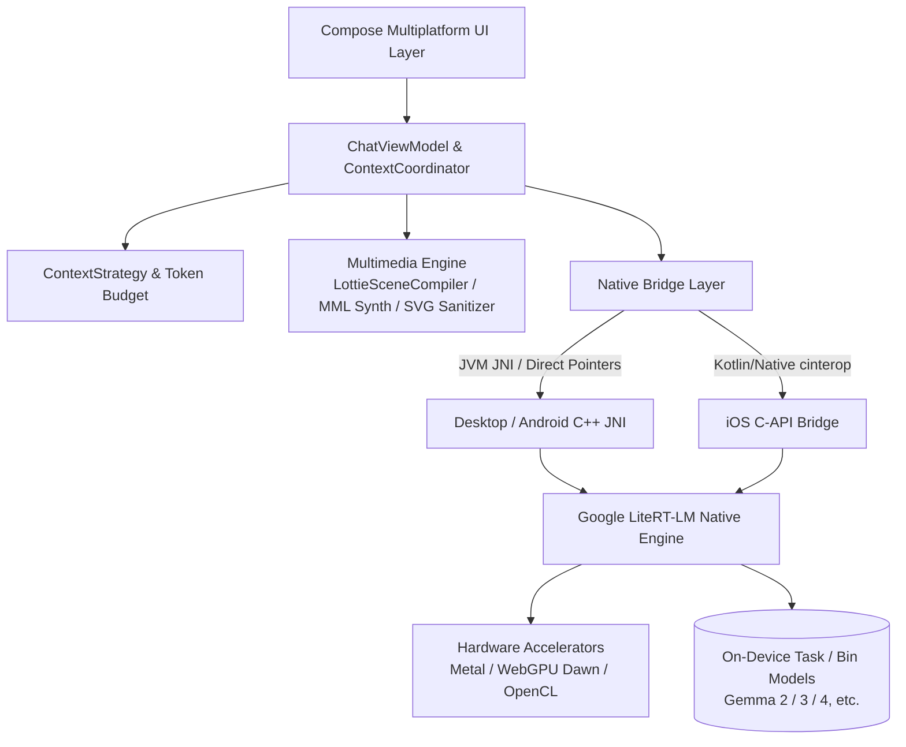

<p align="center">
  
</p>

<h1 align="center">Agro (アグロ)</h1>

<p align="center">
  <strong>Private. Local. Yours.</strong><br/>
  Kotlin Multiplatform と Google LiteRT-LM で構築された、次世代オンデバイスローカルLLM＆自律型AIエージェントクライアント
</p>

<p align="center">
  <a href="README.md">English</a> •
  <a href="README.zh-CN.md">简体中文</a> •
  <a href="README.zh-TW.md">繁體中文</a> •
  <a href="README.ja.md"><b>日本語</b></a> •
  <a href="README.ko.md">한국어</a> •
  <a href="README.de.md">Deutsch</a> •
  <a href="README.es.md">Español</a> •
  <a href="README.fr.md">Français</a> •
  <a href="README.ru.md">Русский</a>
</p>

<p align="center">
  <a href="https://github.com/Onion99/Agro/releases"></a>
  <a href="https://kotlinlang.org/"></a>
  <a href="https://www.jetbrains.com/lp/compose-multiplatform/"></a>
  <a href="https://ai.google.dev/edge/litert"></a>
  <a href="LICENSE"></a>
  <a href="https://github.com/Onion99/Agro"></a>
</p>

---

## 📖 プロジェクト概要

**Agro** は、マルチプラットフォーム（Android、iOS、macOS、Windows、Linux）に対応した**完全ローカル・オンデバイスAIエージェント＆LLMチャットアプリケーション**です。

クラウドAPIに依存する従来のAIアプリとは異なり、Agro は推論エンジン、コンテキストスケジューリング、エージェントツール実行、および AIGC コンテンツレンダリングのすべてをお手元の物理デバイス上で完結させます。Google **LiteRT-LM** ネイティブ C++ 推論エンジンと各プラットフォームのハードウェアアクセラレーション（Apple Metal、WebGPU Dawn、DirectX、Vulkan、OpenCL）を活用し、100% のデータプライバシーを保証しながら、極めてスムーズで高速な生成体験を提供します。

### 🌟 主な特徴

- 🔒 **完全なプライバシーとオフラインファースト (100% Local & Offline First)**：すべての会話、履歴、推論計算はデバイス内で処理され、クラウドへデータが送信されることはありません。
- ⚡ **ネイティブ級のハードウェアアクセラレーション (Hardware Accelerated)**：デスクトップ GPU、Apple Neural Engine/Metal、モバイル GPU に最適化された低レイヤメモリ管理。
- 🧩 **自律型エージェントとツールエコシステム (Agent Loop & Tool Runtime)**：構造化された Tool Calling ループを搭載し、ローカル JavaScript 実行、リアルタイム Web 検索、URL 解析をサポート。
- 🎨 **マルチモーダル構造化生成 (Multimodal Structured Generation)**：テキスト出力のみならず、SVG ベクター画像、8-bit チップチューン音楽（Chiptune BGM）、Lottie ベクターアニメーションをオンデバイスで直接生成・即時プレビュー可能。

---

## ✨ コア機能一覧

| 機能 | 実装内容 |
| --- | --- |
| ローカルLLM | LiteRT-LM 互換の `.litertlm` モデルをロード可能。Ministral-3-3B、Gemma 4 4B のプリセットダウンロードに対応し、カスタムモデルも選択可能 |
| ストリーミング対話 | インクリメンタルテキスト出力、思考（Thinking）プロセス、生成停止、GPU 失敗時の CPU 自動フォールバック、ランタイムフィードバック |
| コンテキスト管理 | 通常対話と構造化生成を分離。ネイティブトークンカウントに基づき、予算予測・履歴再生・制限超過圧縮を実行 |
| Agent Loop | モデルのツール呼び出し要求 → ホスト実行 → 構造化結果のフィードバック → 推論継続（デフォルト最大 10 ターン） |
| Webツール | `searchWeb`（Bing 検索）および `analyzeUrl`（HTTP/HTTPS コンテンツ解析）を標準搭載 |
| クリエイティブモード | アシスタント、SVG 画像生成、8-bit BGM 作曲、Lottie アニメーション作成の 4 つの独立セッションプロトコル |
| ローカル永続化 | Room KMP + Bundled SQLite；セッション、メッセージ履歴、ツールログ、システム指示スナップショットを安全に保存 |
| モデルパラメータ | Temperature、Top P、Top K、コンテキスト上限、Thinking、Speculative Decoding、カスタム system prompt 設定 |

---

## 📱 画面プレビュー

### デスクトップ版 (Desktop Layout)
| チャット画面 (Chat) | ホーム画面 (Home) |
| :---: | :---: |
|  |  |
| **ライブラリ (Library)** | **設定パネル (Settings)** |
|  |  |

### モバイル版 (Mobile Layout)
| モバイルチャット (Mobile Chat) | モバイルホーム (Mobile Home) | モバイルライブラリ (Mobile Library) | モバイル設定 (Mobile Settings) |
| :---: | :---: | :---: | :---: |
|  |  |  |  |

---

## 📦 ダウンロードと対応プラットフォーム

[Releases ページ](https://github.com/Onion99/Agro/releases) より各プラットフォーム向けビルドパッケージを入手できます：

| OS | 配布形式 | ダウンロードリンク | インストール・実行に関する注記 |
| :--- | :--- | :--- | :--- |
| **Android** | `apk` | [Agro-Android.apk](https://github.com/Onion99/Agro/releases) | Android 10.0+ (API 29+) 対応（ARM64 デバイス推奨） |
| **iOS** | `ipa` | [Agro-iOS.ipa](https://github.com/Onion99/Agro/releases) | iOS 16.0+ 対応（AltStore / TrollStore 等によるサイドロードが必要） |
| **Windows** | `exe` / `msi` / `zip` | [Agro-Windows-x86_64.zip](https://github.com/Onion99/Agro/releases) | Windows 10/11 x86_64 推奨（DirectX / WebGPU 依存コンポーネント内蔵） |
| **macOS** | `dmg` | [Agro-macOS-arm64.dmg](https://github.com/Onion99/Agro/releases) | Apple Silicon (M1/M2/M3/M4) 対応。<br/>Gatekeeper にブロックされた場合は次を実行：<br/>`sudo xattr -d com.apple.quarantine /Applications/Agro.app` |
| **Linux** | `AppImage` / `deb` / `rpm` | [Agro-Linux-x86_64.AppImage](https://github.com/Onion99/Agro/releases) | x86_64 アーキテクチャの主要ディストリビューション (Ubuntu, Fedora, Arch など) |

---

## 🏗️ システムアーキテクチャとモジュール設計

本プロジェクトは標準的な **Kotlin Multiplatform (KMP) + Clean Architecture / MVVM** パターンを採用しています：



### 📁 モジュール構成

```
Agro/
├── composeApp/            # メインアプリ、Compose Multiplatform UI、ViewModel、AIGC コンパイラ、JNI ブリッジ
│   └── src/
│       ├── commonMain/    # 共通 UI (Screens, Theme, Components, Navigation) およびビジネスパイプライン
│       ├── androidMain/   # Android ネイティブ設定、Activity、JNI バインディング
│       ├── desktopMain/   # Desktop JVM ネイティブ統合、動的ライブラリ展開、ウィンドウ管理
│       └── iosMain/       # iOS cinterop、AVAudioPlayer、Native ブリッジ
├── shared/                # プラットフォーム共通ロジックとコアコーディネーター
├── ui-theme/              # Ethereal Minimalism デザインシステムトークン (Color, Typography, Shape, Spacing)
├── data-network/          # Ktor 3.x ネットワーククライアントと Sandwich レスポンスモデル
├── data-model/            # 純粋な Kotlin ドメインデータモデルおよびシリアライザー
└── cpp/                   # ネイティブ C++ ワークスペースおよび LiteRT-LM プリビルドライブラリ
    └── lite-rt-lm/        # Google AI Edge LiteRT-LM ソース、C API ヘッダー、Bazel ビルド構成
```

---

## 🛠️ 技術スタックと依存関係

- **主要言語＆プラットフォーム**：Kotlin `2.4.0`、Kotlin Multiplatform、Kotlinx Coroutines `1.10.2`、Kotlinx Serialization `1.8.0`
- **UI フレームワーク**：Compose Multiplatform `1.11.1`、Material 3 Adaptive `1.1.2`、Compose Rich Editor `1.0.0-rc14`
- **アニメーション＆マルチメディア**：Compottie `2.0.0-rc04` (Lottie)、ComposeMediaPlayer `0.11.3`、Coil 3 `3.5.0` (SVG サポート)
- **DI ＆ アーキテクチャ**：Koin `4.1.1` (Core, Compose, ViewModel)、AndroidX Lifecycle ViewModel `2.9.6`、Navigation 3 UI
- **データストレージ**：AndroidX Room `2.8.4` (KMP)、SQLite Bundled `2.6.2`、Okio `3.15.0`、FileKit `0.14.2`
- **ネットワーク＆パーサー**：Ktor `3.2.3`、Sandwich `2.1.2`、Ksoup `0.2.6`、QuickJS-kt `1.0.0-alpha13`
- **低レイヤ AI ランタイム**：Google LiteRT-LM (C++ Runtime)、Metal / WebGPU Dawn / OpenCL / Vulkan 加速、Bazel

---

## 🚀 開発およびビルドガイド

### 1. 環境要件
- **JDK**：Java 21（[JetBrains Runtime 21](https://github.com/JetBrains/JetBrainsRuntime) または Eclipse Temurin 21 推奨）
- **Android 開発**：Android Studio Ladybug+、Android SDK 36、Android NDK `27.0.12077973`
- **iOS / macOS 開発**：macOS 環境、Xcode 15+、Command Line Tools
- **Bazelisk**：LiteRT-LM ネイティブ C++ 依存関係のビルドに [Bazelisk](https://github.com/bazelbuild/bazelisk) を導入
- **Git LFS**：クローン前に Git LFS を有効化し、プリビルド済みバイナリおよびアセットを取得できるようにしてください：
  ```bash
  git lfs install
  ```

### 2. リポジトリのクローン
```bash
# サブモジュールを含めてクローン
git clone --recursive https://github.com/Onion99/Agro.git
cd Agro

# Git LFS アセットを取得
git lfs install
git lfs pull
```

### 3. アプリの起動

#### 🖥️ デスクトップ版 (Desktop / JVM)
```bash
./gradlew :composeApp:run
```

#### 🤖 Android 版
実機を接続するかエミュレータを起動して実行：
```bash
./gradlew :composeApp:installDebug
```

#### 🍏 iOS 版
Xcode で `iosApp/iosApp.xcworkspace` を開き、ターゲット／シミュレータを選択して実行、または Gradle でビルド：
```bash
./gradlew :composeApp:embedAndSignAppleFrameworkForXcode
```

### 4. テストの実行
```bash
# 単元テストおよびデスクトップテストの実行
./gradlew :composeApp:desktopTest
./gradlew :composeApp:allTests
```

### 5. 配布パッケージのビルド (Distribution)
```bash
# 現在の OS 向けデスクトップ配布パッケージの作成 (msi / dmg / deb / rpm)
./gradlew :composeApp:packageDistributionForCurrentOS

# Android リリース用 APK のビルド
./gradlew :composeApp:assembleRelease
```

---

## 📄 ライセンスと謝辞

- 本プロジェクトは **[GNU General Public License v3.0 (GPL-3.0)](LICENSE)** のもとでオープンソースとして公開されています。
- 以下のオープンソースプロジェクトおよびエコシステムに深く感謝いたします：
    - [Google LiteRT-LM (LiteRT)](https://ai.google.dev/edge/litert) — 超高速オンデバイス推論コア
    - [JetBrains Compose Multiplatform](https://www.jetbrains.com/lp/compose-multiplatform/) — クロスプラットフォーム宣言的 UI フレームワーク
    - [Compottie](https://github.com/alexzhirkevich/compottie) — Compose Multiplatform 向け Lottie レンダラー
    - [ComposeMediaPlayer](https://github.com/kdroidFilter/ComposeMediaPlayer) — 軽量マルチプラットフォームメディアプレイヤー
    - [Compose Rich Editor](https://github.com/MohamedRejeb/Compose-Rich-Editor) — Compose Multiplatform 向けリッチテキストエディター
    - [QuickJS-kt](https://github.com/dokar3/quickjs-kt) — 組込み Kotlin JavaScript エンジン
    - [Coil](https://github.com/coil-kt/coil) — Kotlin 非同期画像読み込みライブラリ
    - [Koin](https://insert-koin.io/) & [Ktor](https://ktor.io/) — 依存性注入およびモダンな非同期ネットワークフレームワーク

---

<p align="center">
  Made with 💚 by <strong>Onion99</strong> and the Open Source Community
</p>
