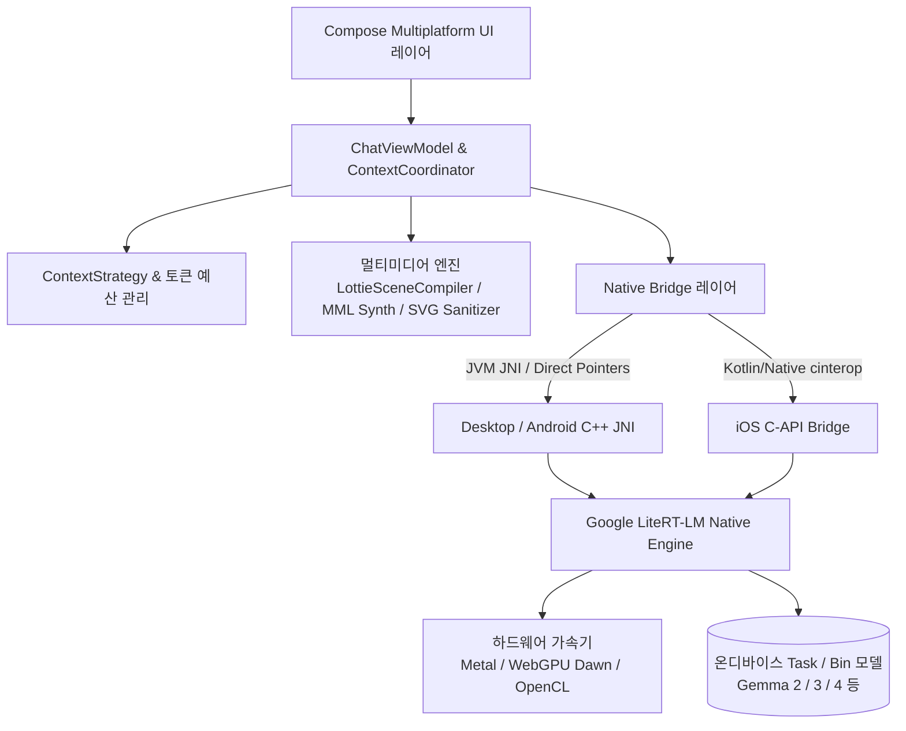

<p align="center">
  
</p>

<h1 align="center">Agro (아그로)</h1>

<p align="center">
  <strong>Private. Local. Yours.</strong><br/>
  Kotlin Multiplatform과 Google LiteRT-LM으로 구축된 차세대 온디바이스 로컬 LLM 및 자율 AI 에이전트 클라이언트
</p>

<p align="center">
  <a href="README.md">English</a> •
  <a href="README.zh-CN.md">简体中文</a> •
  <a href="README.zh-TW.md">繁體中文</a> •
  <a href="README.ja.md">日本語</a> •
  <a href="README.ko.md"><b>한국어</b></a> •
  <a href="README.de.md">Deutsch</a> •
  <a href="README.es.md">Español</a> •
  <a href="README.fr.md">Français</a> •
  <a href="README.ru.md">Русский</a>
</p>

<p align="center">
  <a href="https://github.com/Onion99/Agro/releases"></a>
  <a href="https://kotlinlang.org/"></a>
  <a href="https://www.jetbrains.com/lp/compose-multiplatform/"></a>
  <a href="https://ai.google.dev/edge/litert"></a>
  <a href="LICENSE"></a>
  <a href="https://github.com/Onion99/Agro"></a>
</p>

---

## 📖 프로젝트 개요

**Agro**는 멀티 플랫폼(Android, iOS, macOS, Windows, Linux)을 지원하는 **완전 로컬 온디바이스 거대 언어 모델(LLM) 및 자율 에이전트 채팅 애플리케이션**입니다.

원격 클라우드 API에 의존하는 일반적인 AI 도구와 달리, Agro는 추론 엔진, 컨텍스트 스케줄링, 에이전트 도구 실행 및 AIGC 렌더링 파이프라인 전체를 사용자의 물리적 기기 내에서 직접 구동합니다. Google의 **LiteRT-LM** 네이티브 C++ 런타임과 하드웨어 가속 백엔드(Apple Metal, WebGPU Dawn, DirectX, Vulkan, OpenCL)를 기반으로 하여 100% 데이터 프라이버시를 보장하면서도 즉각적이고 매끄러운 생성형 경험을 제공합니다.

### 🌟 핵심 특징

- 🔒 **100% 로컬 및 오프라인 우선 (Offline-First)**: 모든 대화, 기록, 추론 연산이 사용자의 기기 내부에서만 처리되며, 외부 클라우드로 어떠한 데이터도 전송되지 않습니다.
- ⚡ **네이티브 하드웨어 가속**: 데스크톱 GPU, Apple Neural Engine/Metal 및 모바일 GPU에 최적화된 저수준 메모리 관리 및 가속 파이프라인.
- 🧩 **자율 에이전트 및 도구 생태계 (Agent Loop)**: 모델 구조화 도구 호출, 로컬 JavaScript 실행, 실시간 웹 검색, 웹페이지 URL 분석을 지원하는 에이전트 런타임 내장.
- 🎨 **멀티모달 구조화 생성**: 단순 텍스트 생성을 넘어, 기기 내에서 실시간으로 SVG 벡터 그래픽, 8-bit 칩튠 BGM 사운드, Lottie 마이크로 애니메이션을 직접 합성 및 렌더링.

---

## ✨ 핵심 기능 목록

| 기능 | 세부 구현 내용 |
| --- | --- |
| **로컬 LLM** | LiteRT-LM 호환 `.litertlm` 모델 로드 지원. Ministral-3-3B 및 Gemma 4 4B 원클릭 다운로드 프리셋 내장 및 사용자 지정 로컬 모델 지원 |
| **스트리밍 대화** | 점진적 토큰 스트리밍, 사고(Thinking) 프로세스 분리, 생성 중단, GPU 오류 시 CPU 자동 폴백, 실시간 런타임 텔레메트리 |
| **컨텍스트 관리** | 일반 대화와 구조화 생성을 분리 관리. 네이티브 토큰 계산, 예산 추정, 대화 재생 및 초과 컨텍스트 압축 |
| **에이전트 루프** | 모델 도구 호출 요청 → 호스트 로컬 실행 → 구조화된 페이로드 피드백 → 추론 지속 (기본 최대 10회 루프) |
| **기본 웹 도구** | `searchWeb`(Bing 검색) 및 `analyzeUrl`(HTTP/HTTPS 웹페이지 본문 수집 및 분석) 기본 탑재 |
| **창작 모드** | 4가지 전용 세션 프로토콜: 기본 어시스턴트, SVG 벡터 아트, 8-bit BGM 작곡기, Lottie 애니메이션 플래너 |
| **로컬 영속성** | Room KMP + Bundled SQLite; 세션, 메시지 기록, 도구 실행 로그 및 시스템 프롬프트 스냅샷을 안전하게 보관 |
| **모델 파라미터 제어** | Temperature, Top-P, Top-K, 컨텍스트 제한, Thinking 모드, Speculative Decoding, 커스텀 시스템 프롬프트 미세 조정 |

---

## 📱 인터페이스 소개

### 데스크톱 화면
| 채팅 인터페이스 | 홈 화면 |
| :---: | :---: |
|  |  |
| **리소스 라이브러리** | **설정 패널** |
|  |  |

### 모바일 화면
| 모바일 채팅 | 모바일 홈 | 모바일 라이브러리 | 모바일 설정 |
| :---: | :---: | :---: | :---: |
|  |  |  |  |

---

## 📦 다운로드 및 플랫폼 지원

사전 컴파일된 배포 파일은 [Releases 페이지](https://github.com/Onion99/Agro/releases)에서 바로 다운로드할 수 있습니다:

| 운영체제 | 배포 포맷 | 다운로드 | 설치 및 런타임 안내 |
| :--- | :--- | :--- | :--- |
| **Android** | `apk` | [Agro-Android.apk](https://github.com/Onion99/Agro/releases) | Android 10.0+ (API 29+) 필요; ARM64 기기 권장 |
| **iOS** | `ipa` | [Agro-iOS.ipa](https://github.com/Onion99/Agro/releases) | iOS 16.0+ 필요; AltStore / TrollStore / Xcode를 통한 사이드로딩 |
| **Windows** | `exe` / `msi` / `zip` | [Agro-Windows-x86_64.zip](https://github.com/Onion99/Agro/releases) | Windows 10/11 x86_64 권장; DirectX/WebGPU 런타임 번들 포함 |
| **macOS** | `dmg` | [Agro-macOS-arm64.dmg](https://github.com/Onion99/Agro/releases) | Apple Silicon (M1/M2/M3/M4) 네이티브. Gatekeeper 경고 발생 시 터미널에서 실행:<br/>`sudo xattr -d com.apple.quarantine /Applications/Agro.app` |
| **Linux** | `AppImage` / `deb` / `rpm` | [Agro-Linux-x86_64.AppImage](https://github.com/Onion99/Agro/releases) | 주요 x86_64 배포판 지원 (Ubuntu, Fedora, Arch 등) |

---

## 🏗️ 시스템 아키텍처 및 모듈 설계

Agro는 **Kotlin Multiplatform (KMP) + Clean Architecture / MVVM** 원칙을 준수합니다:



### 📁 디렉터리 및 모듈 구조

```
Agro/
├── composeApp/            # 메인 앱 진입점, Compose Multiplatform UI, ViewModel, AIGC 컴파일러 및 JNI 브리지
│   └── src/
│       ├── commonMain/    # 공통 UI(화면, 테마, 컴포넌트, 내비게이션) 및 비즈니스 파이프라인
│       ├── androidMain/   # Android 네이티브 설정, 액티비티 및 JNI 바인딩
│       ├── desktopMain/   # Desktop JVM 네이티브 연동, 라이브러리 추출기 및 플랫폼 윈도우
│       └── iosMain/       # iOS cinterop, AVAudioPlayer 및 네이티브 브리지
├── shared/                # 멀티플랫폼 공통 비즈니스 로직 및 핵심 코디네이터
├── ui-theme/              # Ethereal Minimalism 디자인 시스템 토큰(색상, 타이포그래피, 형태, 간격)
├── data-network/          # Ktor 3.x 네트워크 클라이언트 및 Sandwich 응답 모델
├── data-model/            # 순수 Kotlin 도메인 데이터 모델 및 직렬화 스키마
└── cpp/                   # 네이티브 C++ 워크스페이스 및 LiteRT-LM 사전 컴파일 런타임
    └── lite-rt-lm/        # Google AI Edge LiteRT-LM 소스코드, C-API 헤더 및 Bazel 빌드 명세
```

---

## 🛠️ 기술 스택 및 종속성

- **핵심 언어 및 플랫폼**: Kotlin `2.4.0`, Kotlin Multiplatform, Kotlinx Coroutines `1.10.2`, Kotlinx Serialization `1.8.0`
- **UI 프레임워크**: Compose Multiplatform `1.11.1`, Material 3 Adaptive `1.1.2`, Compose Rich Editor `1.0.0-rc14`
- **애니메이션 및 미디어**: Compottie `2.0.0-rc04` (Lottie), ComposeMediaPlayer `0.11.3`, Coil 3 `3.5.0` (SVG 지원)
- **종속성 주입 및 아키텍처**: Koin `4.1.1` (Core, Compose, ViewModel), AndroidX Lifecycle ViewModel `2.9.6`, Navigation 3 UI
- **데이터 저장소**: AndroidX Room `2.8.4` (KMP), SQLite Bundled `2.6.2`, Okio `3.15.0`, FileKit `0.14.2`
- **네트워킹 및 파서**: Ktor `3.2.3`, Sandwich `2.1.2`, Ksoup `0.2.6`, QuickJS-kt `1.0.0-alpha13`
- **저수준 AI 엔진**: Google LiteRT-LM (C++ Runtime), Metal / WebGPU Dawn / OpenCL / Vulkan 하드웨어 가속, Bazel

---

## 🚀 개발 및 빌드 가이드

### 1. 사전 요구사항
- **JDK**: Java 21 권장 ([JetBrains Runtime 21](https://github.com/JetBrains/JetBrainsRuntime) 또는 Eclipse Temurin 21)
- **Android 개발**: Android Studio Ladybug+, Android SDK 36, Android NDK `27.0.12077973`
- **iOS / macOS 개발**: macOS 환경, Xcode 15+, Command Line Tools
- **Bazelisk**: LiteRT-LM C++ 빌드 의존성을 위한 [Bazelisk](https://github.com/bazelbuild/bazelisk) 설치
- **Git LFS**: 클론 전 바이너리 자산 동기화를 위해 Git LFS 설치 확인:
  ```bash
  git lfs install
  ```

### 2. 저장소 클론
```bash
# 서브모듈을 포함하여 저장소 클론
git clone --recursive https://github.com/Onion99/Agro.git
cd Agro

# Git LFS 바이너리 에셋 다운로드
git lfs install
git lfs pull
```

### 3. 애플리케이션 실행

#### 🖥️ Desktop (JVM)
```bash
./gradlew :composeApp:run
```

#### 🤖 Android
Android 기기 연결 또는 에뮬레이터 실행 후:
```bash
./gradlew :composeApp:installDebug
```

#### 🍏 iOS
Xcode에서 `iosApp/iosApp.xcworkspace`를 열고 타깃/시뮬레이터를 선택해 서명 후 실행하거나 Gradle로 프레임워크 빌드:
```bash
./gradlew :composeApp:embedAndSignAppleFrameworkForXcode
```

### 4. 테스트 실행
```bash
# 공통 단위 테스트 및 데스크톱 테스트 실행
./gradlew :composeApp:desktopTest
./gradlew :composeApp:allTests
```

### 5. 배포 바이너리 패키징
```bash
# 현재 운영체제용 데스크톱 배포 패키지 빌드 (msi / dmg / deb / rpm)
./gradlew :composeApp:packageDistributionForCurrentOS

# Android 릴리스 APK 빌드
./gradlew :composeApp:assembleRelease
```

---

## 📄 라이선스 및 크레딧

- 본 프로젝트는 **[GNU General Public License v3.0 (GPL-3.0)](LICENSE)** 하에 오픈소스로 공개되어 있습니다.
- 다음 오픈소스 프로젝트 및 커뮤니티에 깊은 감사를 드립니다:
    - [Google LiteRT-LM (LiteRT)](https://ai.google.dev/edge/litert) — 초고속 온디바이스 AI 추론 엔진
    - [JetBrains Compose Multiplatform](https://www.jetbrains.com/lp/compose-multiplatform/) — 크로스 플랫폼 선언형 UI 프레임워크
    - [Compottie](https://github.com/alexzhirkevich/compottie) — Compose Multiplatform용 Lottie 렌더러
    - [ComposeMediaPlayer](https://github.com/kdroidFilter/ComposeMediaPlayer) — 경량 크로스 플랫폼 미디어 플레이어
    - [Compose Rich Editor](https://github.com/MohamedRejeb/Compose-Rich-Editor) — 서식 있는 텍스트 에디터
    - [QuickJS-kt](https://github.com/dokar3/quickjs-kt) — 임베디드 Kotlin JavaScript 엔진
    - [Coil](https://github.com/coil-kt/coil) — Kotlin용 비동기 이미지 로딩 라이브러리
    - [Koin](https://insert-koin.io/) & [Ktor](https://ktor.io/) — 최신 DI 및 비동기 네트워크 스택

---

<p align="center">
  Made with 💚 by <strong>Onion99</strong> and the Open Source Community
</p>
