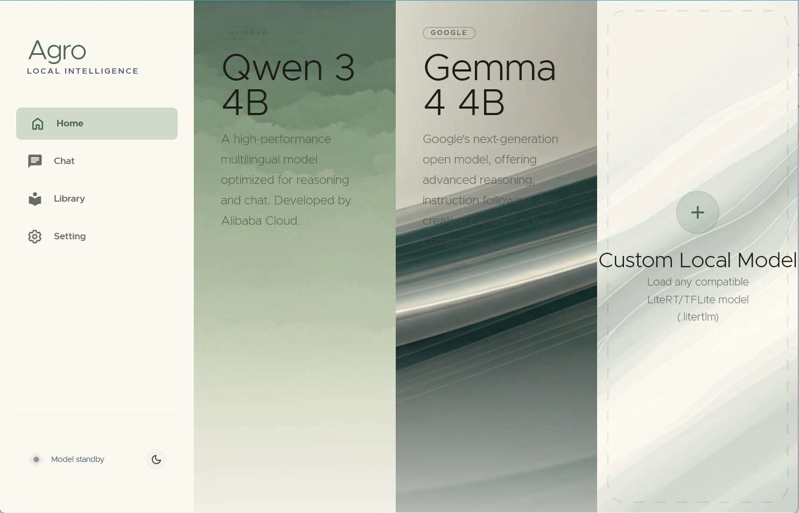
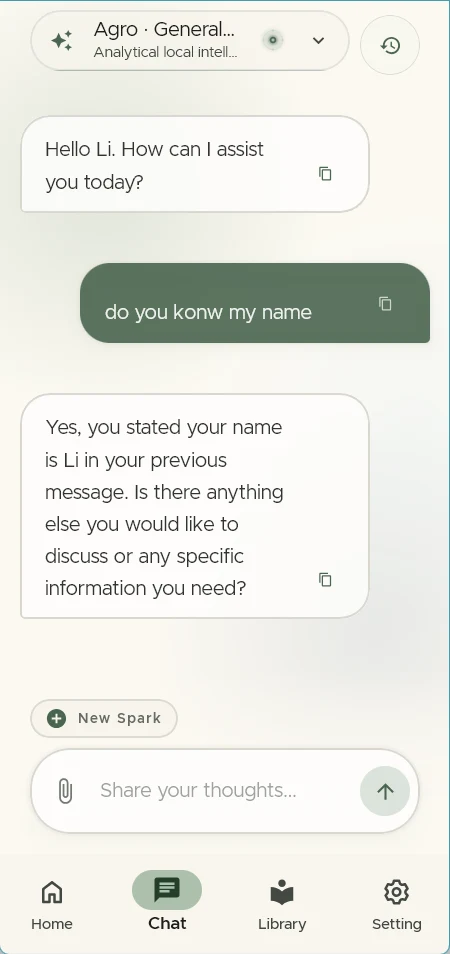
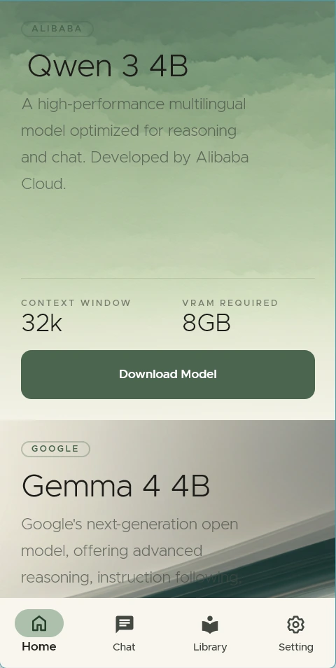
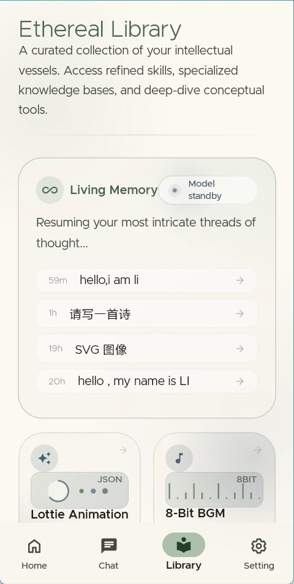
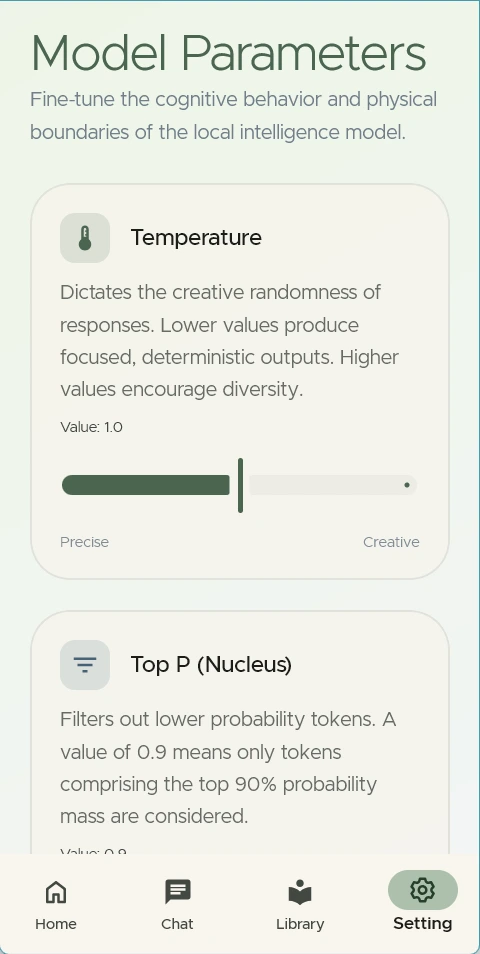
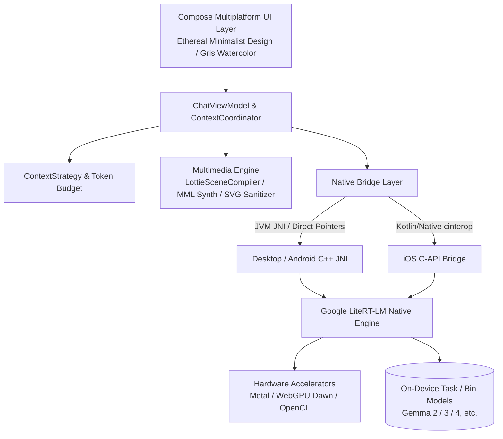

<p align="center">
  
</p>

<h1 align="center">Agro (阿格罗)</h1>

<p align="center">
  <strong>Private. Local. Yours.</strong><br/>
  基于 Kotlin Multiplatform 与 Google LiteRT-LM 构建的下一代端侧本地大语言模型与智能体客户端
</p>

<p align="center">
  <a href="https://github.com/Onion99/Agro/releases"></a>
  <a href="https://kotlinlang.org/"></a>
  <a href="https://www.jetbrains.com/lp/compose-multiplatform/"></a>
  <a href="https://ai.google.dev/edge/litert"></a>
  <a href="LICENSE"></a>
  <a href="https://github.com/Onion99/Agro"></a>
</p>

---

## 📖 项目简介

**Agro** 是一款面向多平台（Android、iOS、macOS、Windows、Linux）的**纯本地端侧智能体与大模型对话应用**。

不同于依赖云端 API 的传统大模型应用，Agro 将完整的推理引擎、上下文调度、智能体工具执行与 AIGC 内容渲染全部搬到了你的物理设备端。借助 Google **LiteRT-LM** 原生 C++ 推理引擎与各平台硬件加速能力（Apple Metal、WebGPU Dawn、DirectX、Vulkan、OpenCL），在保障 100% 数据隐私主权的同时，提供丝滑流畅的生成体验。

### 🌟 核心特性

- 🔒 **绝对隐私与离线优先 (100% Local & Offline First)**：所有对话、历史记录与推理计算均在端侧完成。
- ⚡ **原生级端侧加速 (Hardware Accelerated)**：针对桌面 GPU、Apple Neural Engine/Metal 以及移动端 GPU 进行底层优化与内存管理。
- 🧩 **自主智能体与工具生态 (Agent Loop & Tool Runtime)**：具备结构化工具调用（Tool Calling）闭环，支持本地 JavaScript 、实时网络分析与搜索。
- 🎨 **多模态结构化生成 (Multimodal Structured Generation)**：不仅输出文本，还能在端侧直接生成并即时渲染 SVG 矢量图、8-bit 芯片音乐（Chiptune BGM）与 Lottie 矢量动效。

---

## ✨ 核心能力

| 能力 | 当前实现 |
| --- | --- |
| 本地大模型 | 加载兼容 LiteRT-LM 的 `.litertlm` 文件；内置 Qwen 3 4B、Gemma 4 4B 下载入口，也支持选择自定义模型 |
| 流式对话 | 增量文本、思考通道、停止生成、GPU 失败后显式切换 CPU 重试、模型运行态反馈 |
| 上下文管理 | 区分普通对话与结构化生成；读取原生 token 计数，执行预算预判、历史重放与超限压缩 |
| Agent Loop | 模型请求工具 → 宿主执行 → 结构化结果回灌 → 模型继续推理，默认最多 10 个工具轮次 |
| 网络工具 | 当前注册 `searchWeb`（Bing 搜索）与 `analyzeUrl`（HTTP/HTTPS 内容分析） |
| 创作模式 | 普通助手、SVG 图像、8-bit BGM、Lottie 微动画四种独立会话协议 |
| 本地持久化 | Room KMP + Bundled SQLite；保存会话、消息内容、工具日志和完整 system instruction 快照 |
| 模型参数 | Temperature、Top P、Top K、上下文上限、Thinking、Speculative Decoding、自定义 system prompt |

---

## 📱 界面预览

### 桌面端体验 (Desktop Layout)
| 对话界面 (Chat) | 首页展示 (Home) |
| :---: | :---: |
|  |  |
| **资料库 (Library)** | **设置面板 (Settings)** |
|  |  |

### 移动端体验 (Mobile Layout)
| 移动对话 (Mobile Chat) | 移动首页 (Mobile Home) | 移动资料库 (Mobile Library) | 移动设置 (Mobile Settings) |
| :---: | :---: | :---: | :---: |
|  |  |  |  |

---

## 📦 下载与平台支持

您可以前往 [Releases 页面](https://github.com/Onion99/Agro/releases) 获取各平台预编译安装包：

| 操作系统 | 分发格式 | 下载入口 | 安装与运行说明 |
| :--- | :--- | :--- | :--- |
| **Android** | `apk` | [Agro-Android.apk](https://github.com/Onion99/Agro/releases) | 支持 Android 10.0+ (API 29+)，推荐 ARM64 设备 |
| **iOS** | `ipa` | [Agro-iOS.ipa](https://github.com/Onion99/Agro/releases) | 支持 iOS 16.0+，需通过自签名工具（如 AltStore/TrollStore）安装 |
| **Windows** | `exe` / `msi` / `zip` | [Agro-Windows-x86_64.zip](https://github.com/Onion99/Agro/releases) | 推荐 Windows 10/11 x86_64，包含内置 DirectX/WebGPU 运行依赖 |
| **macOS** | `dmg` | [Agro-macOS-arm64.dmg](https://github.com/Onion99/Agro/releases) | 支持 Apple Silicon (M1/M2/M3/M4)，若遇门禁拦截请执行：<br/>`sudo xattr -d com.apple.quarantine /Applications/Agro.app` |
| **Linux** | `AppImage` / `deb` / `rpm` | [Agro-Linux-x86_64.AppImage](https://github.com/Onion99/Agro/releases) | x86_64 架构主流发行版 (Ubuntu, Fedora, Arch 等) |

---

## 🏗️ 系统架构与模块设计

本项目采用标准的 **Kotlin Multiplatform (KMP) + Clean Architecture / MVVM** 架构分层：



### 📁 模块一览表


```
Agro/
├── composeApp/            # 主应用入口，Compose Multiplatform 页面、ViewModel、AIGC 编译器与 JNI 桥接
│   └── src/
│       ├── commonMain/    # 共享 UI (Screens, Theme, Components, Navigation) 与业务管线
│       ├── androidMain/   # Android 原生配置、Activity 与 JNI 绑定
│       ├── desktopMain/   # Desktop JVM 原生集成、动态库解压与平台窗口
│       └── iosMain/       # iOS cinterop、AVAudioPlayer 与 Native 桥接
├── shared/                # 跨平台共享业务逻辑与核心协调器
├── ui-theme/              # Ethereal Minimalism 设计系统 Token (Color, Typography, Shape, Spacing)
├── data-network/          # Ktor 3.x 跨平台网络客户端与 Sandwich 响应模型
├── data-model/            # 零依赖的纯 Kotlin 领域数据模型与序列化载体
└── cpp/                   # 原生 C++ 工作区与 LiteRT-LM 预编译运行时库
    └── lite-rt-lm/        # Google AI Edge LiteRT-LM 源码、C API 头文件与 Bazel 构建蓝图
```

---

## 🛠️ 技术栈与依赖版本

- **核心语言与平台**：Kotlin `2.4.0`、Kotlin Multiplatform、Kotlinx Coroutines `1.10.2`、Kotlinx Serialization `1.8.0`
- **UI 框架**：Compose Multiplatform `1.11.1`、Material 3 Adaptive `1.1.2`、Compose Rich Editor `1.0.0-rc14`
- **动画与多媒体**：Compottie `2.0.0-rc04` (Lottie)、ComposeMediaPlayer `0.11.3`、Coil 3 `3.5.0` (SVG 支持)
- **依赖注入与架构**：Koin `4.1.1` (Core, Compose, ViewModel)、AndroidX Lifecycle ViewModel `2.9.6`、Navigation 3 UI
- **数据存储**：AndroidX Room `2.8.4` (KMP)、SQLite Bundled `2.6.2`、Okio `3.15.0`、FileKit `0.14.2`
- **网络与解析**：Ktor `3.2.3`、Sandwich `2.1.2`、Ksoup `0.2.6`、QuickJS-kt `1.0.0-alpha13`
- **底层 AI 运行时**：Google LiteRT-LM (C++ Runtime)、Metal / WebGPU Dawn / OpenCL / Vulkan 加速、Bazel

---

## 🚀 开发与编译指南

### 1. 环境准备
- **JDK**：Java 21（推荐 [JetBrains Runtime 21](https://github.com/JetBrains/JetBrainsRuntime) 或 Eclipse Temurin 21）
- **Android 开发**：Android Studio Ladybug+，Android SDK 36，Android NDK `27.0.12077973`
- **iOS / macOS 开发**：macOS 环境，Xcode 15+，Command Line Tools
- **Bazelisk**：安装 [Bazelisk](https://github.com/bazelbuild/bazelisk) 用于构建或对齐 LiteRT-LM 原生 C++ 依赖
- **Git LFS**：克隆前请务必确认安装了 Git LFS 以便拉取预编译原生动态库与资源文件：
  ```bash
  git lfs install
  ```

### 2. 克隆仓库
```bash
# 克隆仓库及子模块
git clone --recursive https://github.com/Onion99/Agro.git
cd Agro

# 拉取 Git LFS 大文件资产
git lfs install
git lfs pull
```

### 3. 运行项目

#### 🖥️ 桌面端 (Desktop / JVM)
```bash
./gradlew :composeApp:run
```

#### 🤖 Android 端
连接 Android 设备或启动模拟器后执行：
```bash
./gradlew :composeApp:installDebug
```

#### 🍏 iOS 端
使用 Xcode 打开 `iosApp/iosApp.xcworkspace`，选择对应 Target / 模拟器进行签名与运行，或通过 Gradle 编译 Framework：
```bash
./gradlew :composeApp:embedAndSignAppleFrameworkForXcode
```

### 4. 运行测试
```bash
# 运行通用单元测试与桌面测试
./gradlew :composeApp:desktopTest
./gradlew :composeApp:allTests
```

### 5. 分发打包 (Distribution)
```bash
# 打包桌面端各格式安装包 (msi / dmg / deb / rpm)
./gradlew :composeApp:packageDistributionForCurrentOS

# 构建 Android 发布版 APK
./gradlew :composeApp:assembleRelease
```

---


## 📄 开源协议与致谢

- 本项目基于 **[GNU General Public License v3.0 (GPL-3.0)](LICENSE)** 协议开源。
- 特别感谢以下开源项目与技术生态：
    - [Google LiteRT-LM (LiteRT)](https://ai.google.dev/edge/litert) — 极速端侧推理核心
    - [JetBrains Compose Multiplatform](https://www.jetbrains.com/lp/compose-multiplatform/) — 跨平台声明式 UI 框架
    - [Compottie](https://github.com/alexzhirkevich/compottie) — Compose Multiplatform Lottie 渲染器
    - [ComposeMediaPlayer](https://github.com/kdroidFilter/ComposeMediaPlayer) — 轻量级跨平台媒体播放引擎
    - [QuickJS-kt](https://github.com/dokar3/quickjs-kt) — 嵌入式 Kotlin JavaScript 引擎
    - [Coil](https://github.com/coil-kt/coil) — Kotlin 异步图片加载库
    - [Koin](https://insert-koin.io/) & [Ktor](https://ktor.io/) — 依赖注入与现代化异步网络框架

---

<p align="center">
  Made with 💚 by <strong>Onion99</strong> and the Open Source Community
</p>