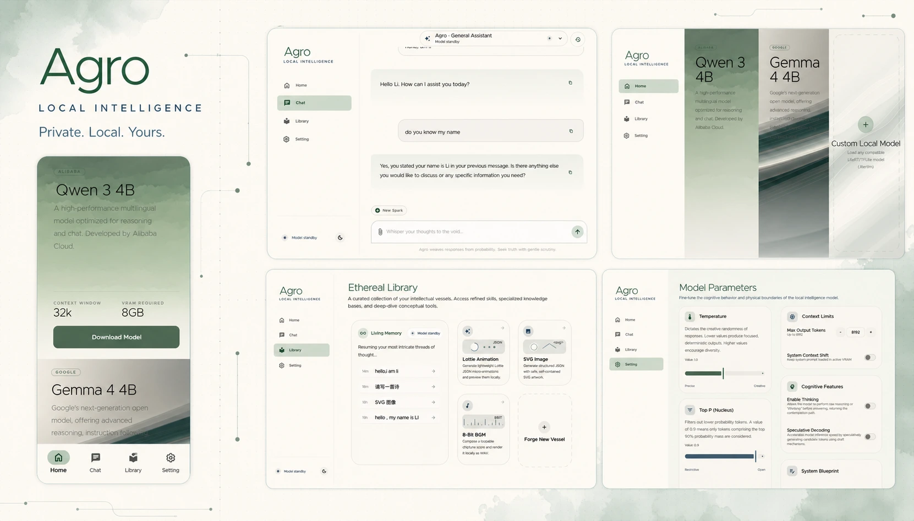
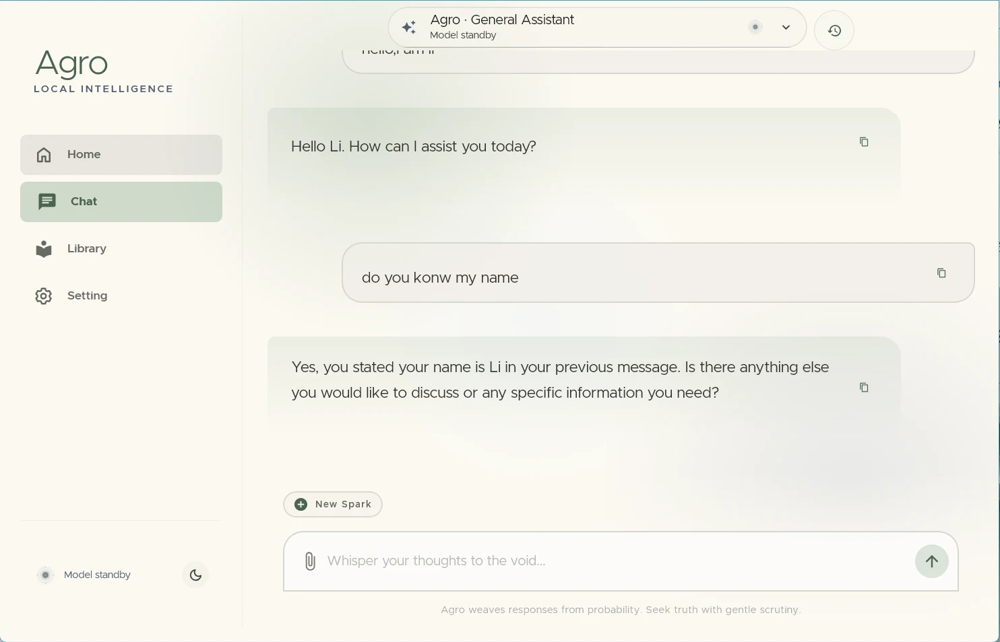
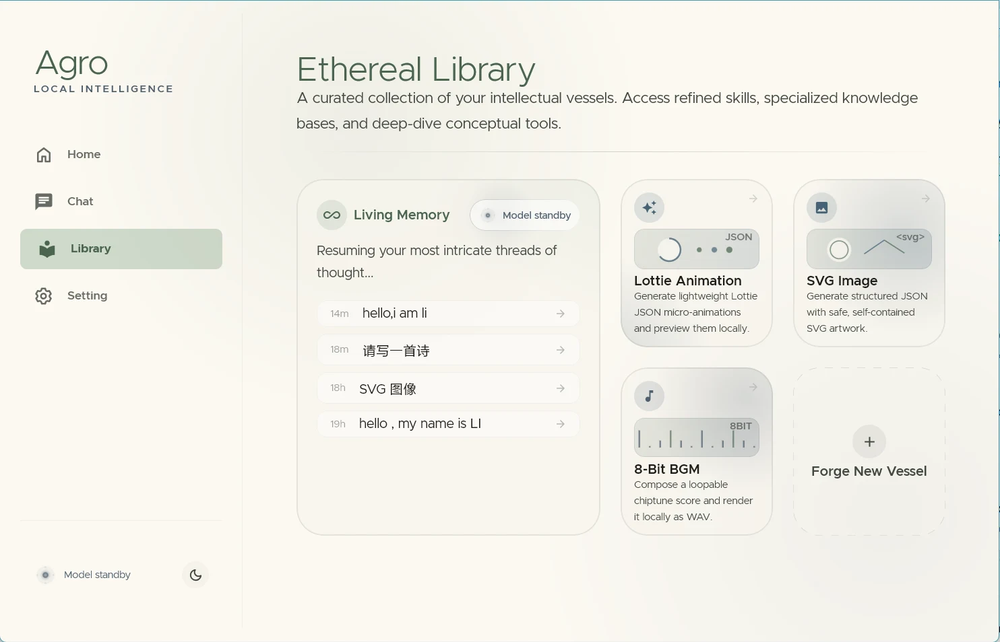
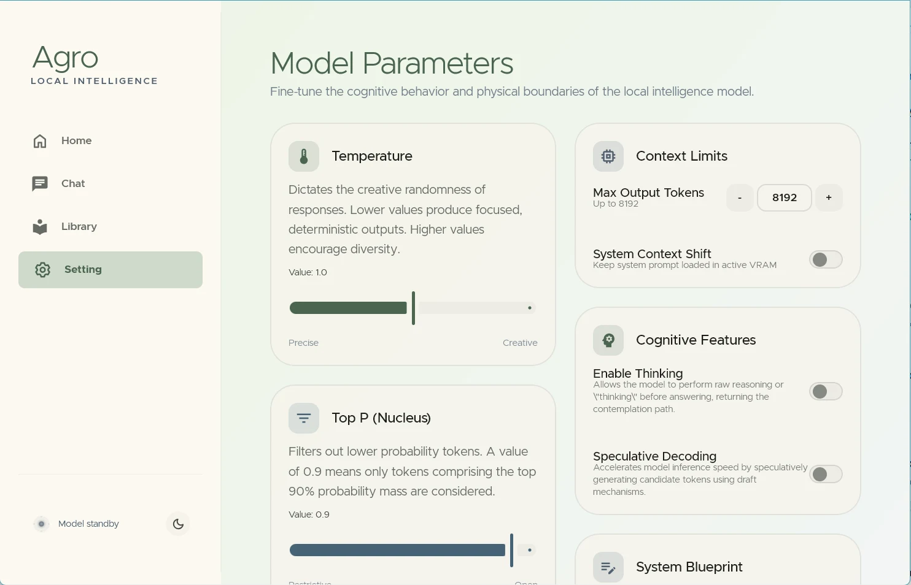
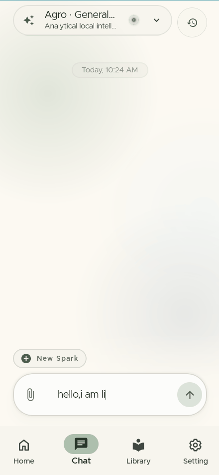
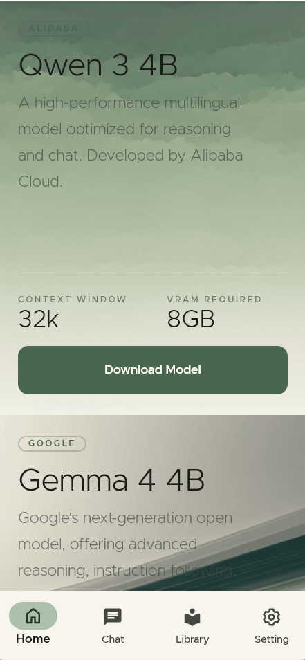
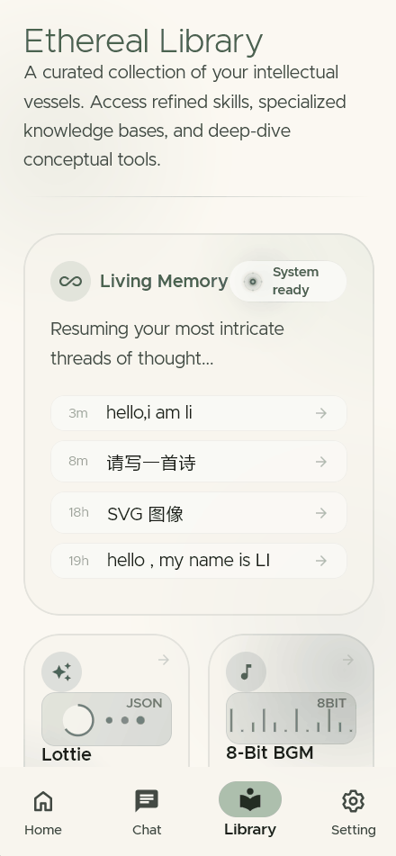
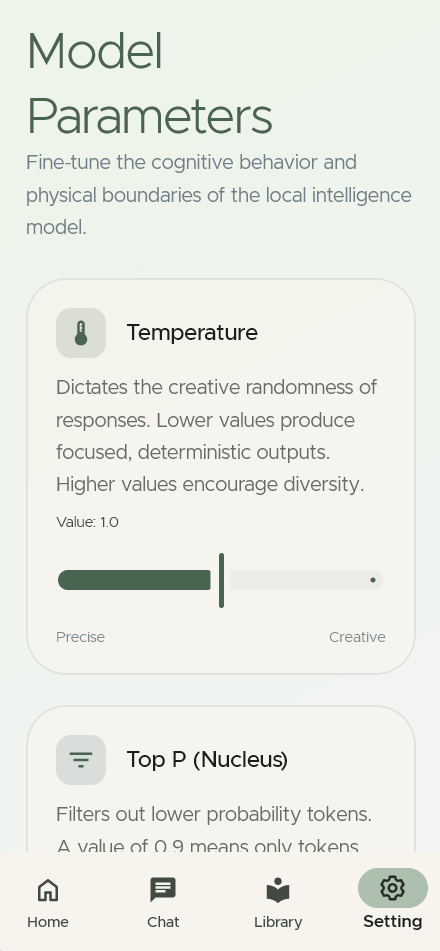
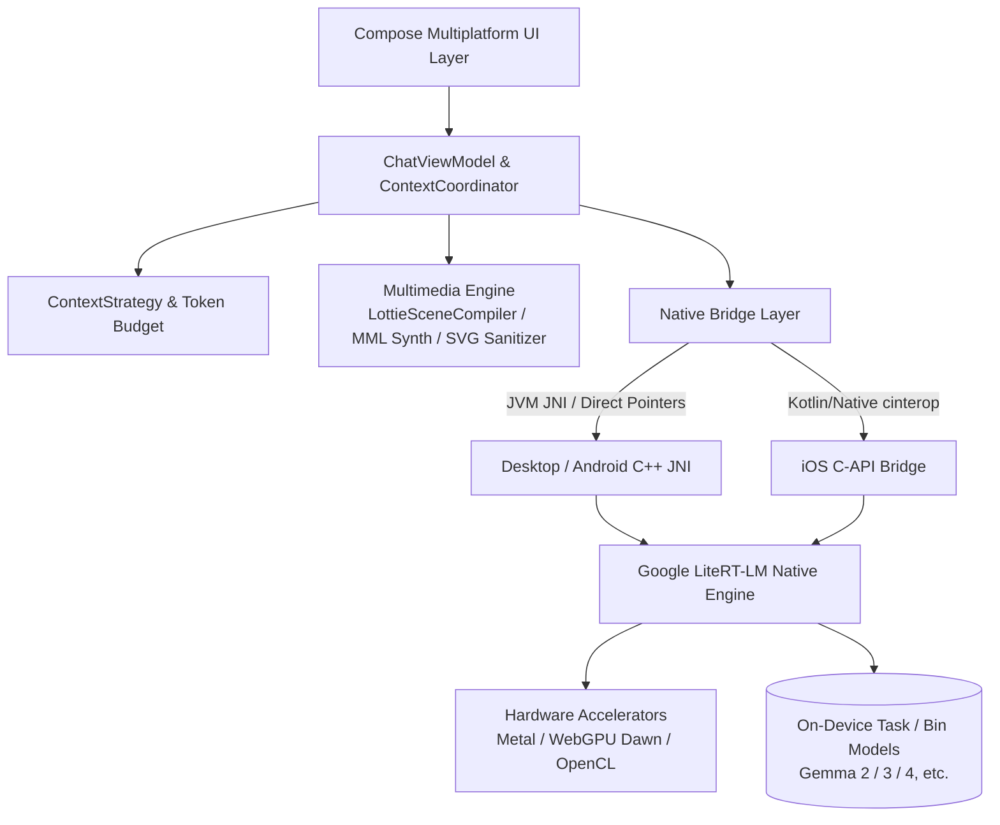

<p align="center">
  
</p>

<h1 align="center">Agro</h1>

<p align="center">
  <strong>Private. Local. Yours.</strong><br/>
  Next-generation on-device local LLM & autonomous agent client built with Kotlin Multiplatform and Google LiteRT-LM
</p>

<p align="center">
  <a href="README.md"><b>English</b></a> •
  <a href="README.zh-CN.md">简体中文</a> •
  <a href="README.zh-TW.md">繁體中文</a> •
  <a href="README.ja.md">日本語</a> •
  <a href="README.ko.md">한국어</a> •
  <a href="README.de.md">Deutsch</a> •
  <a href="README.es.md">Español</a> •
  <a href="README.fr.md">Français</a> •
  <a href="README.ru.md">Русский</a>
</p>

<p align="center">
  <a href="https://github.com/Onion99/Agro/releases"></a>
  <a href="https://kotlinlang.org/"></a>
  <a href="https://www.jetbrains.com/lp/compose-multiplatform/"></a>
  <a href="https://ai.google.dev/edge/litert"></a>
  <a href="LICENSE"></a>
  <a href="https://github.com/Onion99/Agro"></a>
</p>

---

## 📖 Overview

**Agro** is a pure on-device, multi-platform (Android, iOS, macOS, Windows, Linux) **local Large Language Model (LLM) and autonomous agent chat application**.

Unlike conventional AI tools that depend on remote cloud APIs, Agro brings the entire inference engine, context scheduling, agent tool execution, and AIGC rendering directly to your physical device. Powered by Google **LiteRT-LM** native C++ runtime and hardware acceleration backends (Apple Metal, WebGPU Dawn, DirectX, Vulkan, OpenCL), Agro guarantees 100% data privacy sovereignty while delivering an ultra-smooth, responsive generative experience.

### 🌟 Key Highlights

- 🔒 **100% Local & Offline-First**: All conversations, historical records, and inference calculations remain strictly on your device—zero data sent to the cloud.
- ⚡ **Native Hardware Acceleration**: Low-level memory management and GPU optimizations tailored for Desktop GPUs, Apple Neural Engine / Metal, and Mobile GPUs.
- 🧩 **Autonomous Agent Loop & Tool Ecosystem**: Built-in structured tool-calling loop supporting local JavaScript execution, real-time web search, and URL content analysis.
- 🎨 **Multimodal Structured Generation**: Beyond plain text, natively synthesizes and renders SVG vector graphics, 8-bit chiptune audio, and Lottie animations on-device in real time.

---

## ✨ Core Capabilities

| Capability | Implementation Details |
| --- | --- |
| **Local LLMs** | Loads LiteRT-LM compatible `.litertlm` bundles. Built-in one-click downloads for Ministral-3-3B & Gemma 4 4B, with support for custom models |
| **Streaming Chat** | Incremental token streaming, thinking/reasoning channels, mid-generation cancellation, auto CPU fallback upon GPU errors, runtime telemetry |
| **Context Management** | Segregated channels for conversational chat and structured synthesis; reads native token counts, performs budget estimation, history replay, and pruning |
| **Agent Loop** | Model tool call request → Host execution → Structured payload feedback → Continued inference (up to 10 iterations by default) |
| **Built-in Web Tools** | Pre-registered `searchWeb` (Bing search) and `analyzeUrl` (HTTP/HTTPS content fetch & analysis) |
| **Creative Modes** | 4 distinct session protocols: Standard Assistant, SVG Vector Graphics, 8-bit BGM Composer, and Lottie Micro-animation |
| **Local Persistence** | Room KMP + Bundled SQLite; safely persists conversations, messages, tool execution logs, and system prompt snapshots |
| **Model Parameters** | Granular control over Temperature, Top-P, Top-K, Context Window limits, Thinking mode, Speculative Decoding, and custom System Prompts |

---

## 📱 UI Showcase

### Desktop Layout
| Chat Interface | Home Screen |
| :---: | :---: |
|  |  |
| **Model Library** | **Settings Panel** |
|  |  |

### Mobile Layout
| Mobile Chat | Mobile Home | Mobile Library | Mobile Settings |
| :---: | :---: | :---: | :---: |
|  |  |  |  |

---

## 📦 Downloads & Platform Support

Download precompiled release binaries directly from the [Releases Page](https://github.com/Onion99/Agro/releases):

| OS | Distribution Format | Download Entry | Installation & Runtime Notes |
| :--- | :--- | :--- | :--- |
| **Android** | `apk` | [Agro-Android.apk](https://github.com/Onion99/Agro/releases) | Requires Android 10.0+ (API 29+); ARM64 devices recommended |
| **iOS** | `ipa` | [Agro-iOS.ipa](https://github.com/Onion99/Agro/releases) | Requires iOS 16.0+; sideload via AltStore / TrollStore / Xcode |
| **Windows** | `exe` / `msi` / `zip` | [Agro-Windows-x86_64.zip](https://github.com/Onion99/Agro/releases) | Windows 10/11 x86_64 recommended; includes bundled DirectX/WebGPU runtimes |
| **macOS** | `dmg` | [Agro-macOS-arm64.dmg](https://github.com/Onion99/Agro/releases) | Apple Silicon (M1/M2/M3/M4) native. If blocked by Gatekeeper, run:<br/>`sudo xattr -d com.apple.quarantine /Applications/Agro.app` |
| **Linux** | `AppImage` / `deb` / `rpm` | [Agro-Linux-x86_64.AppImage](https://github.com/Onion99/Agro/releases) | Major x86_64 distributions (Ubuntu, Fedora, Arch, etc.) |

---

## 🏗️ System Architecture & Modular Design

Agro adheres to standard **Kotlin Multiplatform (KMP) + Clean Architecture / MVVM** principles:



### 📁 Directory & Module Layout

```
Agro/
├── composeApp/            # Main application entry, Compose Multiplatform UI, ViewModel, AIGC compilers, and JNI bridges
│   └── src/
│       ├── commonMain/    # Shared UI (Screens, Theme, Components, Navigation) & business pipelines
│       ├── androidMain/   # Android native configurations, Activities & JNI bindings
│       ├── desktopMain/   # Desktop JVM native integration, shared library unpacker & platform windows
│       └── iosMain/       # iOS cinterop, AVAudioPlayer & Native bridge
├── shared/                # Cross-platform shared business logic & core coordinators
├── ui-theme/              # Ethereal Minimalism design system tokens (Color, Typography, Shape, Spacing)
├── data-network/          # Ktor 3.x cross-platform network client & Sandwich response models
├── data-model/            # Pure Kotlin domain data models & serialization schemas
└── cpp/                   # Native C++ workspace & LiteRT-LM precompiled runtime libraries
    └── lite-rt-lm/        # Google AI Edge LiteRT-LM sources, C-API headers & Bazel build blueprints
```

---

## 🛠️ Tech Stack & Dependencies

- **Core Language & Platform**: Kotlin `2.4.0`, Kotlin Multiplatform, Kotlinx Coroutines `1.10.2`, Kotlinx Serialization `1.8.0`
- **UI Framework**: Compose Multiplatform `1.11.1`, Material 3 Adaptive `1.1.2`, Compose Rich Editor `1.0.0-rc14`
- **Animations & Multimedia**: Compottie `2.0.0-rc04` (Lottie), ComposeMediaPlayer `0.11.3`, Coil 3 `3.5.0` (SVG support)
- **Dependency Injection & Architecture**: Koin `4.1.1` (Core, Compose, ViewModel), AndroidX Lifecycle ViewModel `2.9.6`, Navigation 3 UI
- **Data Storage**: AndroidX Room `2.8.4` (KMP), SQLite Bundled `2.6.2`, Okio `3.15.0`, FileKit `0.14.2`
- **Networking & Parsers**: Ktor `3.2.3`, Sandwich `2.1.2`, Ksoup `0.2.6`, QuickJS-kt `1.0.0-alpha13`
- **Low-Level AI Runtime**: Google LiteRT-LM (C++ Runtime), Metal / WebGPU Dawn / OpenCL / Vulkan acceleration, Bazel

---

## 🚀 Development & Build Guide

### 1. Prerequisites
- **JDK**: Java 21 (Recommend [JetBrains Runtime 21](https://github.com/JetBrains/JetBrainsRuntime) or Eclipse Temurin 21)
- **Android Development**: Android Studio Ladybug+, Android SDK 36, Android NDK `27.0.12077973`
- **iOS / macOS Development**: macOS environment, Xcode 15+, Command Line Tools
- **Bazelisk**: Install [Bazelisk](https://github.com/bazelbuild/bazelisk) for building or aligning LiteRT-LM native C++ dependencies
- **Git LFS**: Ensure Git LFS is installed prior to cloning to pull precompiled native libraries and assets:
  ```bash
  git lfs install
  ```

### 2. Clone Repository
```bash
# Clone repository and submodules
git clone --recursive https://github.com/Onion99/Agro.git
cd Agro

# Fetch Git LFS binary assets
git lfs install
git lfs pull
```

### 3. Launch the Application

#### 🖥️ Desktop (Desktop / JVM)
```bash
./gradlew :composeApp:run
```

#### 🤖 Android
Connect your Android device or launch an emulator, then run:
```bash
./gradlew :composeApp:installDebug
```

#### 🍏 iOS
Open `iosApp/iosApp.xcworkspace` in Xcode, select your Target/Simulator for code signing and running, or build the framework via Gradle:
```bash
./gradlew :composeApp:embedAndSignAppleFrameworkForXcode
```

### 4. Run Tests
```bash
# Execute common unit tests and desktop tests
./gradlew :composeApp:desktopTest
./gradlew :composeApp:allTests
```

### 5. Distribution Packaging
```bash
# Package desktop distribution binaries for the current OS (msi / dmg / deb / rpm)
./gradlew :composeApp:packageDistributionForCurrentOS

# Build Android release APK
./gradlew :composeApp:assembleRelease
```

---

## 📄 License & Acknowledgements

- This project is open-sourced under the **[GNU General Public License v3.0 (GPL-3.0)](LICENSE)**.
- Special thanks to the following open-source projects and communities:
    - [Google LiteRT-LM (LiteRT)](https://ai.google.dev/edge/litert) — Ultra-fast on-device inference core
    - [JetBrains Compose Multiplatform](https://www.jetbrains.com/lp/compose-multiplatform/) — Cross-platform declarative UI framework
    - [Compottie](https://github.com/alexzhirkevich/compottie) — Lottie renderer for Compose Multiplatform
    - [ComposeMediaPlayer](https://github.com/kdroidFilter/ComposeMediaPlayer) — Lightweight cross-platform media player
    - [Compose Rich Editor](https://github.com/MohamedRejeb/Compose-Rich-Editor) — Rich text editor for Compose Multiplatform
    - [QuickJS-kt](https://github.com/dokar3/quickjs-kt) — Embedded Kotlin JavaScript engine
    - [Coil](https://github.com/coil-kt/coil) — Asynchronous image loading for Kotlin
    - [Koin](https://insert-koin.io/) & [Ktor](https://ktor.io/) — Modern DI & asynchronous networking stack

---

<p align="center">
  Made with 💚 by <strong>Onion99</strong> and the Open Source Community
</p>