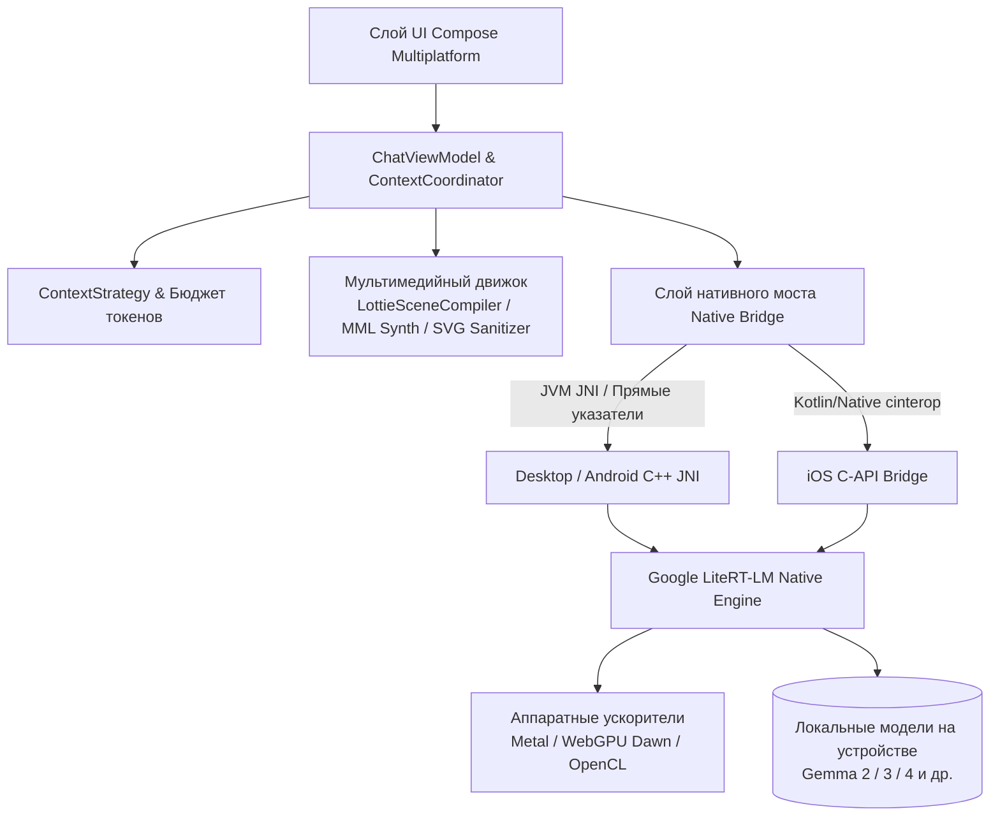

<p align="center">
  
</p>

<h1 align="center">Agro</h1>

<p align="center">
  <strong>Приватно. Локально. Твоё.</strong><br/>
  Локальный клиент нового поколения для работы с LLM и автономными агентами на устройстве, созданный на Kotlin Multiplatform и Google LiteRT-LM
</p>

<p align="center">
  <a href="README.md">English</a> •
  <a href="README.zh-CN.md">简体中文</a> •
  <a href="README.zh-TW.md">繁體中文</a> •
  <a href="README.ja.md">日本語</a> •
  <a href="README.ko.md">한국어</a> •
  <a href="README.de.md">Deutsch</a> •
  <a href="README.es.md">Español</a> •
  <a href="README.fr.md">Français</a> •
  <a href="README.ru.md"><b>Русский</b></a>
</p>

<p align="center">
  <a href="https://github.com/Onion99/Agro/releases"></a>
  <a href="https://kotlinlang.org/"></a>
  <a href="https://www.jetbrains.com/lp/compose-multiplatform/"></a>
  <a href="https://ai.google.dev/edge/litert"></a>
  <a href="LICENSE"></a>
  <a href="https://github.com/Onion99/Agro"></a>
</p>

---

## 📖 О проекте

**Agro** — это кроссплатформенное (Android, iOS, macOS, Windows, Linux) приложение для **локального запуска больших языковых моделей (LLM) и работы с автономными агентами непосредственно на вашем устройстве**.

В отличие от традиционных ИИ-сервисов, зависящих от удаленных облачных API, Agro выполняет весь цикл инференса, управление контекстом, запуск инструментов агента и рендеринг мультимедиа прямо на физическом устройстве. Благодаря нативному C++ движку Google **LiteRT-LM** и аппаратной акселерации (Apple Metal, WebGPU Dawn, DirectX, Vulkan, OpenCL), Agro обеспечивает 100% конфиденциальность и суверенитет ваших данных, гарантируя при этом высокую скорость и плавность генерации.

### 🌟 Ключевые особенности

- 🔒 **100% Локально и Offline-First**: Все диалоги, история и вычисления остаются исключительно на вашем устройстве — ни одного байта не отправляется в облако.
- ⚡ **Нативное аппаратное ускорение**: Низкоуровневое управление памятью и оптимизация под GPU ПК, Apple Neural Engine / Metal и мобильные графические ускорители.
- 🧩 **Автономные агенты и экосистема инструментов**: Встроенный структурированный цикл вызова инструментов (Tool Calling) с поддержкой выполнения локального JavaScript, веб-поиска в реальном времени и парсинга веб-страниц.
- 🎨 **Мультимодальная структурированная генерация**: Помимо текста, приложение синтезирует и визуализирует векторную графику SVG, 8-битные музыкальные дорожки Chiptune и Lottie-анимации прямо на устройстве.

---

## ✨ Основные возможности

| Возможность | Описание реализации |
| --- | --- |
| **Локальные LLM** | Загрузка совместимых с LiteRT-LM пакетов `.litertlm`. Встроенная загрузка моделей Ministral-3-3B и Gemma 4 4B в один клик, а также поддержка собственных моделей |
| **Потоковый чат** | Инкрементальный вывод токенов, каналы рассуждений (Thinking), мгновенная отмена генерации, автоматический переход на CPU при сбое GPU, телеметрия в реальном времени |
| **Управление контекстом** | Раздельные каналы для свободного общения и структурированного синтеза; точный подсчет токенов, бюджетирование, воспроизведение истории и очистка контекста |
| **Цикл агента (Agent Loop)** | Запрос инструмента моделью → Локальное выполнение хостом → Структурированный ответ → Продолжение инференса (до 10 итераций по умолчанию) |
| **Веб-инструменты** | Предустановленные инструменты: `searchWeb` (поиск Bing) и `analyzeUrl` (извлечение и анализ веб-страниц по HTTP/HTTPS) |
| **Творческие режимы** | 4 специализированных режима: Универсальный ассистент, Векторная графика SVG, 8-bit BGM композитор и Lottie-анимации |
| **Локальное хранение** | Room KMP + встроенный SQLite; безопасное сохранение диалогов, сообщений, логов выполнения инструментов и системных инструкций |
| **Параметры моделей** | Гибкая настройка: Temperature, Top-P, Top-K, лимит контекстного окна, режим Thinking, Speculative Decoding и пользовательские системные промпты |

---

## 📱 Интерфейс приложения

### Версия для ПК
| Интерфейс чата | Главный экран |
| :---: | :---: |
|  |  |
| **Библиотека ресурсов** | **Панель настроек** |
|  |  |

### Мобильная версия
| Мобильный чат | Главная | Мобильная библиотека | Настройки |
| :---: | :---: | :---: | :---: |
|  |  |  |  |

---

## 📦 Загрузка и поддержка платформ

Готовые бинарные файлы доступны на [странице релизов (Releases)](https://github.com/Onion99/Agro/releases):

| ОС | Формат пакета | Загрузка | Примечания по установке и запуску |
| :--- | :--- | :--- | :--- |
| **Android** | `apk` | [Agro-Android.apk](https://github.com/Onion99/Agro/releases) | Требуется Android 10.0+ (API 29+); рекомендуются устройства ARM64 |
| **iOS** | `ipa` | [Agro-iOS.ipa](https://github.com/Onion99/Agro/releases) | Требуется iOS 16.0+; установка через AltStore / TrollStore / Xcode |
| **Windows** | `exe` / `msi` / `zip` | [Agro-Windows-x86_64.zip](https://github.com/Onion99/Agro/releases) | Рекомендуется Windows 10/11 x86_64; включает встроенные компоненты DirectX/WebGPU |
| **macOS** | `dmg` | [Agro-macOS-arm64.dmg](https://github.com/Onion99/Agro/releases) | Нативно для Apple Silicon (M1/M2/M3/M4). При блокировке Gatekeeper выполните:<br/>`sudo xattr -d com.apple.quarantine /Applications/Agro.app` |
| **Linux** | `AppImage` / `deb` / `rpm` | [Agro-Linux-x86_64.AppImage](https://github.com/Onion99/Agro/releases) | Поддержка основных дистрибутивов x86_64 (Ubuntu, Fedora, Arch и др.) |

---

## 🏗️ Архитектура системы

Agro следует принципам **Kotlin Multiplatform (KMP) + Clean Architecture / MVVM**:



### 📁 Структура каталогов и модулей

```
Agro/
├── composeApp/            # Главная точка входа, интерфейс Compose Multiplatform, ViewModel, компиляторы AIGC и JNI-мосты
│   └── src/
│       ├── commonMain/    # Общий UI (экраны, тема, компоненты, навигация) и бизнес-логика
│       ├── androidMain/   # Специфичные настройки Android, активности и JNI-биндинги
│       ├── desktopMain/   # Десктопная JVM-интеграция, распаковщик нативных библиотек и оконная система
│       └── iosMain/       # cinterop для iOS, AVAudioPlayer и нативный мост
├── shared/                # Кроссплатформенная бизнес-логика и координаторы
├── ui-theme/              # Токены дизайн-системы Ethereal Minimalism (цвета, шрифты, формы, отступы)
├── data-network/          # Сетевой клиент Ktor 3.x и модели ответов Sandwich
├── data-model/            # Модели данных предметной области на чистом Kotlin
└── cpp/                   # Нативное рабочее пространство C++ и скомпилированные библиотеки LiteRT-LM
    └── lite-rt-lm/        # Исходный код Google AI Edge LiteRT-LM, заголовки C-API и схемы сборки Bazel
```

---

## 🛠️ Стек технологий и зависимости

- **Язык и платформа**: Kotlin `2.4.0`, Kotlin Multiplatform, Kotlinx Coroutines `1.10.2`, Kotlinx Serialization `1.8.0`
- **Фреймворк интерфейса**: Compose Multiplatform `1.11.1`, Material 3 Adaptive `1.1.2`, Compose Rich Editor `1.0.0-rc14`
- **Анимации и медиа**: Compottie `2.0.0-rc04` (Lottie), ComposeMediaPlayer `0.11.3`, Coil 3 `3.5.0` (поддержка SVG)
- **Внедрение зависимостей и архитектура**: Koin `4.1.1` (Core, Compose, ViewModel), AndroidX Lifecycle ViewModel `2.9.6`, Navigation 3 UI
- **Локальное хранилище**: AndroidX Room `2.8.4` (KMP), SQLite Bundled `2.6.2`, Okio `3.15.0`, FileKit `0.14.2`
- **Сеть и парсеры**: Ktor `3.2.3`, Sandwich `2.1.2`, Ksoup `0.2.6`, QuickJS-kt `1.0.0-alpha13`
- **Низкоуровневый движок ИИ**: Google LiteRT-LM (C++ Runtime), аппаратное ускорение Metal / WebGPU Dawn / OpenCL / Vulkan, Bazel

---

## 🚀 Руководство по разработке и сборке

### 1. Требования
- **JDK**: Java 21 (рекомендуется [JetBrains Runtime 21](https://github.com/JetBrains/JetBrainsRuntime) или Eclipse Temurin 21)
- **Разработка для Android**: Android Studio Ladybug+, Android SDK 36, Android NDK `27.0.12077973`
- **Разработка для iOS / macOS**: macOS, Xcode 15+, Command Line Tools
- **Bazelisk**: Установите [Bazelisk](https://github.com/bazelbuild/bazelisk) для сборки зависимостей C++ LiteRT-LM
- **Git LFS**: Убедитесь, что установлен Git LFS перед клонированием репозитория:
  ```bash
  git lfs install
  ```

### 2. Клонирование репозитория
```bash
# Клонирование репозитория вместе с подмодулями
git clone --recursive https://github.com/Onion99/Agro.git
cd Agro

# Загрузка бинарных файлов через Git LFS
git lfs install
git lfs pull
```

### 3. Запуск приложения

#### 🖥️ ПК (JVM)
```bash
./gradlew :composeApp:run
```

#### 🤖 Android
Подключите устройство Android или запустите эмулятор, затем выполните:
```bash
./gradlew :composeApp:installDebug
```

#### 🍏 iOS
Откройте `iosApp/iosApp.xcworkspace` в Xcode, выберите целевое устройство/симулятор и запустите проект, либо выполните сборку фреймворка через Gradle:
```bash
./gradlew :composeApp:embedAndSignAppleFrameworkForXcode
```

### 4. Запуск тестов
```bash
# Запуск модульных тестов и десктопных тестов
./gradlew :composeApp:desktopTest
./gradlew :composeApp:allTests
```

### 5. Сборка дистрибутивов
```bash
# Сборка пакета для текущей операционной системы (msi / dmg / deb / rpm)
./gradlew :composeApp:packageDistributionForCurrentOS

# Сборка релизного APK для Android
./gradlew :composeApp:assembleRelease
```

---

## 📄 Лицензия и благодарности

- Проект распространяется под свободной лицензией **[GNU General Public License v3.0 (GPL-3.0)](LICENSE)**.
- Выражаем особую благодарность проектам с открытым исходным кодом:
    - [Google LiteRT-LM (LiteRT)](https://ai.google.dev/edge/litert) — Сверхбыстрый локальный движок инференса
    - [JetBrains Compose Multiplatform](https://www.jetbrains.com/lp/compose-multiplatform/) — Декларативный кроссплатформенный UI-фреймворк
    - [Compottie](https://github.com/alexzhirkevich/compottie) — Lottie-рендерер для Compose Multiplatform
    - [ComposeMediaPlayer](https://github.com/kdroidFilter/ComposeMediaPlayer) — Легковесный медиаплеер
    - [Compose Rich Editor](https://github.com/MohamedRejeb/Compose-Rich-Editor) — Редактор форматированного текста
    - [QuickJS-kt](https://github.com/dokar3/quickjs-kt) — Встроенный движок JavaScript для Kotlin
    - [Coil](https://github.com/coil-kt/coil) — Асинхронная загрузка изображений
    - [Koin](https://insert-koin.io/) & [Ktor](https://ktor.io/) — Архитектурный стек DI и асинхронной сети

---

<p align="center">
  Создано с 💚 разработчиком <strong>Onion99</strong> и сообществом открытого исходного кода
</p>
