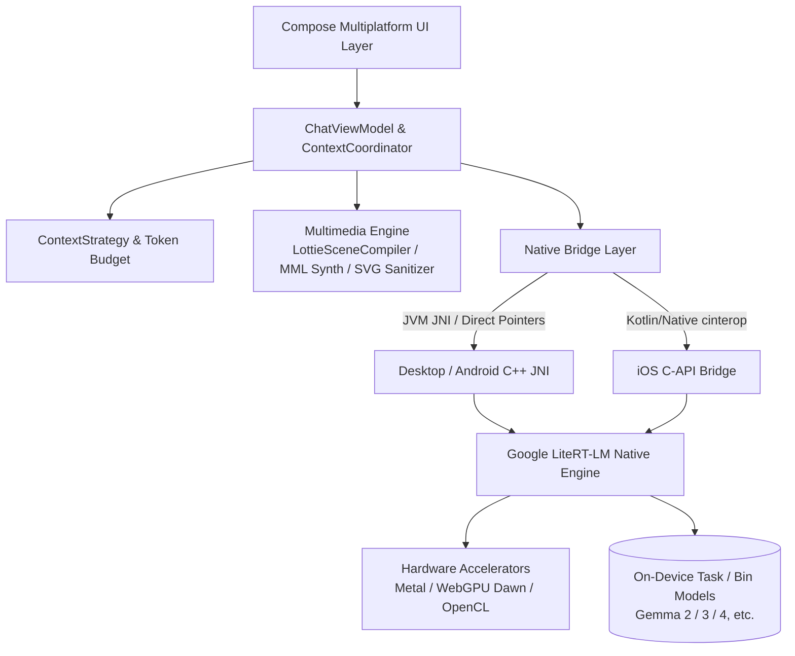

<p align="center">
  
</p>

<h1 align="center">Agro (阿格羅)</h1>

<p align="center">
  <strong>Private. Local. Yours.</strong><br/>
  基於 Kotlin Multiplatform 與 Google LiteRT-LM 構建的下一代端側本地大型語言模型與智慧體客戶端
</p>

<p align="center">
  <a href="README.md">English</a> •
  <a href="README.zh-CN.md">简体中文</a> •
  <a href="README.zh-TW.md"><b>繁體中文</b></a> •
  <a href="README.ja.md">日本語</a>
</p>

<p align="center">
  <a href="https://github.com/Onion99/Agro/releases"></a>
  <a href="https://kotlinlang.org/"></a>
  <a href="https://www.jetbrains.com/lp/compose-multiplatform/"></a>
  <a href="https://ai.google.dev/edge/litert"></a>
  <a href="LICENSE"></a>
  <a href="https://github.com/Onion99/Agro"></a>
</p>

---

## 📖 專案簡介

**Agro** 是一款面向多平台（Android、iOS、macOS、Windows、Linux）的**純本地端側智慧體與大型語言模型對話應用程式**。

不同於依賴雲端 API 的傳統大模型應用，Agro 將完整的推論引擎、上下文調度、智慧體工具執行與 AIGC 內容渲染全部移至您的實體裝置端。借助 Google **LiteRT-LM** 原生 C++ 推論引擎與各平台硬體加速能力（Apple Metal、WebGPU Dawn、DirectX、Vulkan、OpenCL），在保障 100% 數據隱私主權的同時，提供絲滑流暢的生成體驗。

### 🌟 核心特性

- 🔒 **絕對隱私與離線優先 (100% Local & Offline First)**：所有對話、歷史記錄與推論計算均在裝置端完成，數據永不上傳雲端。
- ⚡ **原生級端側加速 (Hardware Accelerated)**：針對桌面 GPU、Apple Neural Engine/Metal 以及行動端 GPU 進行底層最佳化與記憶體管理。
- 🧩 **自主智慧體與工具生態 (Agent Loop & Tool Runtime)**：具備結構化工具調用（Tool Calling）閉環，支援本地 JavaScript 引擎執行、即時網路分析與搜尋。
- 🎨 **多模態結構化生成 (Multimodal Structured Generation)**：不僅能輸出文字，還能在端側直接生成並即時渲染 SVG 向量圖、8-bit 晶片音樂（Chiptune BGM）與 Lottie 向量動畫。

---

## ✨ 核心能力

| 能力 | 當前實現 |
| --- | --- |
| 本地大模型 | 載入相容 LiteRT-LM 的 `.litertlm` 檔案；內建 Ministral-3-3B、Gemma 4 4B 下載入口，亦支援自訂模型 |
| 串流對話 | 增量文字、思考通道、中斷生成、GPU 失敗後明確切換 CPU 重試、模型執行狀態反饋 |
| 上下文管理 | 區分普通對話與結構化生成；讀取原生 token 計數，執行預算預判、歷史重放與超限壓縮 |
| Agent Loop | 模型請求工具 → 宿主執行 → 結構化結果回灌 → 模型繼續推論，預設最多 10 個工具輪次 |
| 網路工具 | 當前註冊 `searchWeb`（Bing 搜尋）與 `analyzeUrl`（HTTP/HTTPS 內容分析） |
| 創作模式 | 普通助手、SVG 影像、8-bit BGM、Lottie 微動畫四種獨立對話協議 |
| 本地持久化 | Room KMP + Bundled SQLite；保存對話、訊息內容、工具日誌與完整 system instruction 快照 |
| 模型參數 | Temperature、Top P、Top K、上下文上限、Thinking、Speculative Decoding、自訂 system prompt |

---

## 📱 介面預覽

### 桌面端體驗 (Desktop Layout)
| 對話介面 (Chat) | 首頁展示 (Home) |
| :---: | :---: |
|  |  |
| **資料庫 (Library)** | **設定面板 (Settings)** |
|  |  |

### 行動端體驗 (Mobile Layout)
| 行動對話 (Mobile Chat) | 行動首頁 (Mobile Home) | 行動資料庫 (Mobile Library) | 行動設定 (Mobile Settings) |
| :---: | :---: | :---: | :---: |
|  |  |  |  |

---

## 📦 下載與平台支援

您可以前往 [Releases 頁面](https://github.com/Onion99/Agro/releases) 獲取各平台預編譯安裝套件：

| 作業系統 | 發行格式 | 下載入口 | 安裝與執行說明 |
| :--- | :--- | :--- | :--- |
| **Android** | `apk` | [Agro-Android.apk](https://github.com/Onion99/Agro/releases) | 支援 Android 10.0+ (API 29+)，推薦 ARM64 裝置 |
| **iOS** | `ipa` | [Agro-iOS.ipa](https://github.com/Onion99/Agro/releases) | 支援 iOS 16.0+，需透過自簽名工具（如 AltStore/TrollStore）安裝 |
| **Windows** | `exe` / `msi` / `zip` | [Agro-Windows-x86_64.zip](https://github.com/Onion99/Agro/releases) | 推薦 Windows 10/11 x86_64，包含內建 DirectX/WebGPU 執行依賴 |
| **macOS** | `dmg` | [Agro-macOS-arm64.dmg](https://github.com/Onion99/Agro/releases) | 支援 Apple Silicon (M1/M2/M3/M4)，若遇 Gatekeeper 攔截請執行：<br/>`sudo xattr -d com.apple.quarantine /Applications/Agro.app` |
| **Linux** | `AppImage` / `deb` / `rpm` | [Agro-Linux-x86_64.AppImage](https://github.com/Onion99/Agro/releases) | x86_64 架構主流發行版 (Ubuntu, Fedora, Arch 等) |

---

## 🏗️ 系統架構與模組設計

本專案採用標準的 **Kotlin Multiplatform (KMP) + Clean Architecture / MVVM** 架構分層：



### 📁 模組一覽表

```
Agro/
├── composeApp/            # 主應用程式入口，Compose Multiplatform 畫面、ViewModel、AIGC 編譯器與 JNI 橋接
│   └── src/
│       ├── commonMain/    # 共享 UI (Screens, Theme, Components, Navigation) 與業務管線
│       ├── androidMain/   # Android 原生配置、Activity 與 JNI 綁定
│       ├── desktopMain/   # Desktop JVM 原生整合、動態庫解壓與平台視窗
│       └── iosMain/       # iOS cinterop、AVAudioPlayer 與 Native 橋接
├── shared/                # 跨平台共享業務邏輯與核心協調器
├── ui-theme/              # Ethereal Minimalism 設計系統 Token (Color, Typography, Shape, Spacing)
├── data-network/          # Ktor 3.x 跨平台網路客戶端與 Sandwich 回應模型
├── data-model/            # 零依賴的純 Kotlin 領域資料模型與序列化載體
└── cpp/                   # 原生 C++ 工作區與 LiteRT-LM 預編譯執行時期庫
    └── lite-rt-lm/        # Google AI Edge LiteRT-LM 原始碼、C API 標頭檔與 Bazel 建構藍圖
```

---

## 🛠️ 技術棧與依賴版本

- **核心語言與平台**：Kotlin `2.4.0`、Kotlin Multiplatform、Kotlinx Coroutines `1.10.2`、Kotlinx Serialization `1.8.0`
- **UI 框架**：Compose Multiplatform `1.11.1`、Material 3 Adaptive `1.1.2`、Compose Rich Editor `1.0.0-rc14`
- **動畫與多媒體**：Compottie `2.0.0-rc04` (Lottie)、ComposeMediaPlayer `0.11.3`、Coil 3 `3.5.0` (SVG 支援)
- **依賴注入與架構**：Koin `4.1.1` (Core, Compose, ViewModel)、AndroidX Lifecycle ViewModel `2.9.6`、Navigation 3 UI
- **資料儲存**：AndroidX Room `2.8.4` (KMP)、SQLite Bundled `2.6.2`、Okio `3.15.0`、FileKit `0.14.2`
- **網路與解析**：Ktor `3.2.3`、Sandwich `2.1.2`、Ksoup `0.2.6`、QuickJS-kt `1.0.0-alpha13`
- **底層 AI 執行時期**：Google LiteRT-LM (C++ Runtime)、Metal / WebGPU Dawn / OpenCL / Vulkan 加速、Bazel

---

## 🚀 開發與編譯指南

### 1. 環境準備
- **JDK**：Java 21（推薦 [JetBrains Runtime 21](https://github.com/JetBrains/JetBrainsRuntime) 或 Eclipse Temurin 21）
- **Android 開發**：Android Studio Ladybug+，Android SDK 36，Android NDK `27.0.12077973`
- **iOS / macOS 開發**：macOS 環境，Xcode 15+，Command Line Tools
- **Bazelisk**：安裝 [Bazelisk](https://github.com/bazelbuild/bazelisk) 用於構建或對齊 LiteRT-LM 原生 C++ 依賴
- **Git LFS**：複製前請務必確認安裝了 Git LFS 以便拉取預編譯原生動態庫與資源檔案：
  ```bash
  git lfs install
  ```

### 2. 複製倉庫 (Clone)
```bash
# 複製倉庫及子模組
git clone --recursive https://github.com/Onion99/Agro.git
cd Agro

# 拉取 Git LFS 大檔案資產
git lfs install
git lfs pull
```

### 3. 執行專案

#### 🖥️ 桌面端 (Desktop / JVM)
```bash
./gradlew :composeApp:run
```

#### 🤖 Android 端
連接 Android 裝置或啟動模擬器後執行：
```bash
./gradlew :composeApp:installDebug
```

#### 🍏 iOS 端
使用 Xcode 開啟 `iosApp/iosApp.xcworkspace`，選擇對應 Target / 模擬器進行簽名與執行，或透過 Gradle 編譯 Framework：
```bash
./gradlew :composeApp:embedAndSignAppleFrameworkForXcode
```

### 4. 執行測試
```bash
# 執行通用單元測試與桌面測試
./gradlew :composeApp:desktopTest
./gradlew :composeApp:allTests
```

### 5. 發布打包 (Distribution)
```bash
# 打包桌面端各格式安裝套件 (msi / dmg / deb / rpm)
./gradlew :composeApp:packageDistributionForCurrentOS

# 建構 Android 發行版 APK
./gradlew :composeApp:assembleRelease
```

---

## 📄 開源協議與致謝

- 本專案基於 **[GNU General Public License v3.0 (GPL-3.0)](LICENSE)** 協議開源。
- 特別感謝以下開源專案與技術生態：
    - [Google LiteRT-LM (LiteRT)](https://ai.google.dev/edge/litert) — 極速端側推論核心
    - [JetBrains Compose Multiplatform](https://www.jetbrains.com/lp/compose-multiplatform/) — 跨平台聲明式 UI 框架
    - [Compottie](https://github.com/alexzhirkevich/compottie) — Compose Multiplatform Lottie 渲染器
    - [ComposeMediaPlayer](https://github.com/kdroidFilter/ComposeMediaPlayer) — 輕量級跨平台媒體播放引擎
    - [QuickJS-kt](https://github.com/dokar3/quickjs-kt) — 嵌入式 Kotlin JavaScript 引擎
    - [Coil](https://github.com/coil-kt/coil) — Kotlin 非同步圖片載入庫
    - [Koin](https://insert-koin.io/) & [Ktor](https://ktor.io/) — 依賴注入與現代化非同步網路框架

---

<p align="center">
  Made with 💚 by <strong>Onion99</strong> and the Open Source Community
</p>
