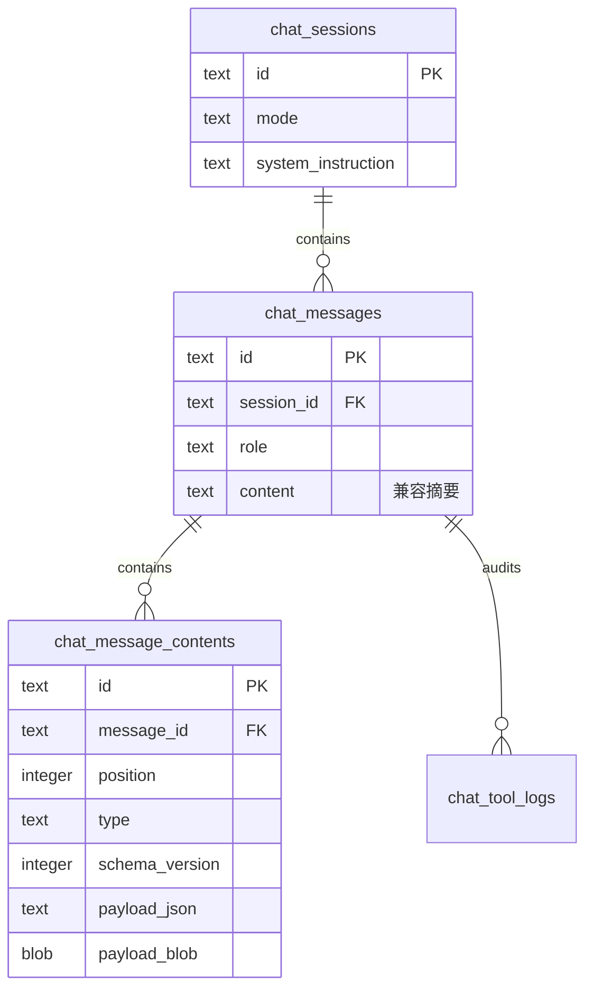

# 可扩展聊天消息内容架构

> 日期: 2026-07-25  
> 范围: `data-model` 消息模型、Room v2、ChatViewModel 响应管线与 Chat UI

## 1. 背景与目标

旧消息结构把文本、位图和视频帧放在同一个 `ChatMessage` 上，数据库也只有一个
`chat_messages.content` 文本列。每增加一种消息类型，都需要继续扩展父对象和消息气泡，
且无法可靠保存 SVG 等结构化内容。

本次重构将“消息信封”和“消息内容”分离：

- `ChatMessage` 只保存角色、时间、工具记录、元数据和有序内容列表。
- `ChatMessageContent` 用密封接口表达当前支持的内容类型。
- Room 使用父消息表与有序内容子表，一条消息可以包含多个异构内容块。
- ViewModel 在响应完成后完成解析与安全校验，Composable 只消费已类型化内容。
- 未识别类型或更高版本不会导致历史记录加载失败，而是降级为可复制的
  `Unsupported` 内容。

## 2. 领域模型

`ChatMessage.contents: List<ChatMessageContent>` 当前支持：

| 类型 | `type` | 主要载荷 | UI |
| --- | --- | --- | --- |
| `Text` | `text` | UTF-8 文本 | Markdown 富文本 |
| `RasterImage` | `raster_image` | BLOB、MIME、宽高 | Coil 位图预览 |
| `SvgImage` | `svg_image` | 自包含 SVG、宽高 | Coil SVG 预览、复制、保存 |
| `Unsupported` | `unsupported` | 原始载荷、声明类型、失败原因 | 降级提示与源码复制 |

所有内容块都有独立的 `schemaVersion`。`CURRENT_SCHEMA_VERSION` 当前为 `1`。
新增类型时必须为已有读取路径保留 unknown-type fallback；修改已有载荷含义时必须提升
内容版本并添加兼容解码。

## 3. 持久化布局



`payload_json` 保存轻量结构化元数据，`payload_blob` 只保存位图等二进制数据。SVG
是文本格式，保存在 JSON 载荷中。`(message_id, position)` 唯一索引保证消息内容顺序
确定；更新父消息及其内容列表通过 Room transaction 完成。

`chat_messages.content` 在 v2 继续保留，用于兼容、会话标题和摘要检索，不再作为完整消息
正文的唯一事实来源。SVG 和位图不会写入该列，避免大载荷污染会话列表。

## 4. SVG 响应管线

SVG 专用会话要求模型输出：

```json
{
  "type": "svg_image",
  "svg": "<svg xmlns='http://www.w3.org/2000/svg' width='1024' height='1024' viewBox='0 0 1024 1024'>...</svg>"
}
```

`SvgMessageParser` 在生成完成后执行以下检查：

1. 外层必须是合法 JSON object，`type` 与 `svg` 必须是字符串。
2. 类型必须为 `svg_image`，SVG UTF-8 大小不得超过 1 MiB。
3. 禁止 `DOCTYPE`、`ENTITY`、`script`、`foreignObject`、事件属性、
   `@import`、外部 `href` 与非 fragment `url(...)`。
4. XML 标签必须严格配对，文档只能有一个 `svg` 根元素，且根元素必须声明标准 SVG
   namespace。
5. 必须能从 `width`/`height` 或 `viewBox` 得到有效画布尺寸。

任一步失败都会产生 `Unsupported`，保留原始响应和机器可读原因，不把未校验 markup
交给 SVG 解码器。

## 5. 会话上下文快照

`ChatSessionMode` 当前包含 `DEFAULT` 与 `SVG_IMAGE`。Room 会话记录同时保存：

- `mode`：用于重开历史会话时选择 constrained decoding 与解析管线。
- `system_instruction`：实际成功应用到原生 LLM conversation 的 system instruction
  快照。

`ConversationContextState.isApplied` 区分“用户选择了某种聊天对象”和“模型已经成功应用
该上下文”。Chat 页顶部提示 UI 直接展示这份状态，避免 UI 文案与实际模型会话分叉。

## 6. UI 扩展规则

- `ChatBubble` 只负责角色外壳，`MessageContentList` 对内容块做穷尽式分发。
- 每种新内容类型提供独立 Composable，不在通用气泡中解析协议。
- 颜色、间距、圆角和玻璃表面必须来自 `AppTheme` token。
- 所有可见文案与无障碍描述必须进入 Compose Resources。
- 媒体类型必须提供失败态；结构化内容必须保留复制原始载荷的退路。

新增消息类型时需要同步：

1. `ChatMessageContent` 子类型与 `type` 常量。
2. Repository 的 vN 编解码及 Room 数据载荷说明。
3. `MessageContentList` 渲染分支和必要交互。
4. 兼容/失败测试、Schema 文档与 `CHANGELOG.md`。

