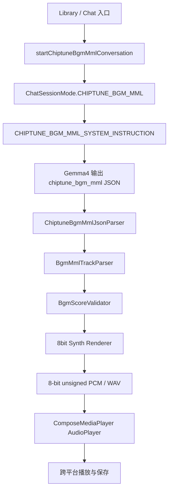

# Gemma4 8bit BGM JSON + MML Tracks 与 ComposeMediaPlayer 播放路线计划

> 日期: 2026-07-27  
> 范围: `ChatViewModel` 专用会话入口、`chiptune_bgm_mml` JSON envelope、轨道级 MML、8bit renderer、ComposeMediaPlayer audio 播放与保存  
> 状态: 计划稿  
> 关联文档: `docs/designs/gemma4-8bit-bgm-generation-plan.md`、`docs/designs/gemma4-8bit-bgm-system-instruction-route-plan.md`、`docs/designs/gemma4-8bit-bgm-mml-system-instruction-route-plan.md`  
> 外部参考: `https://github.com/kdroidFilter/ComposeMediaPlayer/blob/master/README_AUDIO.MD`

## 1. 背景

8bit BGM 可以用事件 JSON、纯 MML 或 `JSON + MML tracks` 三种协议承载。事件 JSON 最容易 schema 校验，但 token 成本高；纯 MML token 成本低，但模式、元数据和错误恢复不够稳定。

本路线采用折中方案: Gemma4 输出一个原始 JSON 对象，JSON 负责类型、标题、BPM、循环长度、采样率和通道列表；每个 track 的具体旋律使用 MML 字符串表达。客户端先解析 JSON，再逐轨解析 MML，最终统一转换成内部 `BgmScore`，交给本地 8bit Synth Renderer 输出 8-bit unsigned PCM / WAV。

跨平台播放层优先评估 ComposeMediaPlayer audio module。其 README_AUDIO 说明该模块是 Compose Multiplatform 的轻量音频播放器，支持 Android、iOS、JVM Desktop 和 Web/WASM，可播放本地文件或 HTTP(S) 音频，并提供播放、暂停、停止、seek、volume、状态读取和错误回调。README_AUDIO 的格式表也将 WAV 列为 Android、iOS、JVM 和 Web 的本地播放支持格式。

## 2. 路线总览



## 3. 路线定位

| 路线 | 优点 | 缺点 | 建议定位 |
| --- | --- | --- | --- |
| 事件 JSON | 校验最强，适合工具调用和可视化编辑 | token 多，旋律不直观 | 稳定默认协议 |
| 纯 MML | 最短，可读，可人工编辑 | 元数据弱，parser 容错压力高 | 高级编辑或导出格式 |
| JSON + MML tracks | 元数据稳定，旋律紧凑，易持久化 | 需要 JSON parser 和 MML parser 两层校验 | 首版优先候选路线 |

本路线的关键原则: renderer 不直接消费模型输出。JSON 和 MML 都必须先转换为内部 `BgmScore`，renderer 只处理已校验的 score。

## 4. 输出协议

### 4.1 JSON Envelope

模型输出必须是单个原始 JSON 对象，不允许 Markdown code fence、解释文本、外部文件路径、PCM 数组、WAV base64 或可执行脚本。

推荐 schema:

```json
{
  "type": "chiptune_bgm_mml",
  "schemaVersion": 1,
  "title": "Sunny Farm Loop",
  "seed": 18421,
  "bpm": 140,
  "timeSignature": "4/4",
  "loopBars": 8,
  "sampleRate": 22050,
  "bitDepth": 8,
  "masterVolume": 0.8,
  "tracks": [
    {
      "channel": "pulse1",
      "dutyCycle": 0.5,
      "mml": "T140 O5 L8 V12 C E G >C <G E C R | C E G >D <G E C R"
    },
    {
      "channel": "pulse2",
      "dutyCycle": 0.25,
      "mml": "T140 O4 L8 V9 E G C G E G C G | F A C A F A C A"
    },
    {
      "channel": "triangle",
      "mml": "T140 O3 L8 C C G G A A G2 R2 | F F E E D D C2 R2"
    },
    {
      "channel": "noise",
      "mml": "T140 L16 K R H R S R H R K R H H S R H R | K R H R S R H R K R H H S R H R"
    }
  ]
}
```

### 4.2 字段约束

| 字段 | 约束 |
| --- | --- |
| `type` | 固定为 `chiptune_bgm_mml` |
| `schemaVersion` | 首版固定为 `1` |
| `title` | 1 到 48 个可显示字符 |
| `seed` | 可选；缺失时由规范化 JSON payload 计算稳定 hash |
| `bpm` | `60..200` |
| `timeSignature` | 首版固定 `4/4` |
| `loopBars` | `2..16` |
| `sampleRate` | 首版默认 `22050`，可选 `11025`、`22050`、`44100` |
| `bitDepth` | 固定 `8` |
| `masterVolume` | `0.0..1.0` |
| `tracks` | 1 到 4 条；推荐完整输出 `pulse1`、`pulse2`、`triangle`、`noise` |

### 4.3 Track 约束

| Channel | 波形 | 约束 |
| --- | --- | --- |
| `pulse1` | 50% square/pulse | 主旋律，高音区，`dutyCycle` 默认 `0.5` |
| `pulse2` | 25% 或 12.5% square/pulse | 和声、反旋律、琶音，`dutyCycle` 默认 `0.25` |
| `triangle` | triangle | bass line，推荐 `O2..O3`，MML 内 `V` 可忽略 |
| `noise` | white noise | 鼓组节奏，只允许 noise drum token |

## 5. MML 子集

### 5.1 通用 token

| Token | 说明 |
| --- | --- |
| `T140` | tempo；如果出现，必须等于顶层 `bpm` |
| `O1..O7` | 八度 |
| `L1 L2 L4 L8 L16 L32` | 默认音长 |
| `V0..V15` | 音量；`triangle` 可忽略 |
| `A B C D E F G` | 自然音 |
| `C# D# F# G# A#` | 升音 |
| `D- E- G- A- B-` | 降音 |
| `R` 或 `P` | 休止符 |
| `.` | 附点，时值乘以 1.5 |
| `>` | 八度上移 |
| `<` | 八度下移 |
| `|` | 小节分隔符，仅用于可读性 |
| `[ ... ]xN` | 重复块，`N` 范围 `2..8` |

### 5.2 音长规则

- `C4` 表示四分音符。
- `C8.` 表示附点八分音符。
- `R16` 表示十六分休止。
- 未显式音长时使用当前 `L`。
- parser 使用有理数 tick 累加，避免浮点误差导致 track 对齐失败。

### 5.3 Noise Track

`noise` track 不使用音高字母表达旋律，首版使用鼓 token:

| Token | 说明 |
| --- | --- |
| `K` | kick |
| `S` | snare |
| `H` | closed hihat |
| `T` | tom |
| `R` 或 `P` | rest |

注意: `noise` track 的 `T` 与 tempo token 有歧义。解析规则应优先识别 `T` 后跟数字为 tempo，例如 `T140`；单独 `T` 为 tom。

## 6. 专用 System Instruction 草案

```text
You are ${BuildConfig.APP_NAME}'s dedicated 8-bit chiptune BGM composer.

Your only job is to output one raw valid JSON object containing loopable 8-bit BGM tracks written in Music Macro Language.
Do not use Markdown fences. Do not add intro text or explanations.
Do not output WAV, PCM samples, base64 audio, MIDI binaries, file paths, or scripts.

Use this JSON schema exactly:
{
  "type": "chiptune_bgm_mml",
  "schemaVersion": 1,
  "title": "<BGM Title>",
  "seed": 12345,
  "bpm": 140,
  "timeSignature": "4/4",
  "loopBars": 8,
  "sampleRate": 22050,
  "bitDepth": 8,
  "masterVolume": 0.8,
  "tracks": [
    {
      "channel": "pulse1",
      "dutyCycle": 0.5,
      "mml": "T140 O5 L8 V12 C E G >C <G E C R | C E G >D <G E C R"
    },
    {
      "channel": "pulse2",
      "dutyCycle": 0.25,
      "mml": "T140 O4 L8 V9 E G C G E G C G | F A C A F A C A"
    },
    {
      "channel": "triangle",
      "mml": "T140 O3 L8 C C G G A A G2 R2 | F F E E D D C2 R2"
    },
    {
      "channel": "noise",
      "mml": "T140 L16 K R H R S R H R K R H H S R H R | K R H R S R H R K R H H S R H R"
    }
  ]
}

Rules:
- The root "type" must be exactly "chiptune_bgm_mml".
- "schemaVersion" must be 1.
- "bpm" must be between 60 and 200.
- "timeSignature" must be "4/4".
- "loopBars" must be between 2 and 16.
- "sampleRate" must be 22050 unless the user explicitly asks for 11025 or 44100.
- "bitDepth" must be 8.
- Use 1 to 4 tracks and prefer all four channels: pulse1, pulse2, triangle, noise.
- pulse1 dutyCycle should be 0.5.
- pulse2 dutyCycle should be 0.25 or 0.125.
- If an MML string includes T[bpm], it must match the top-level bpm exactly.
- For melodic tracks, use O1-O7, L1/L2/L4/L8/L16/L32, V0-V15, notes A-G, sharps with #, flats with -, rests R or P, octave shifts < and >, bar separator |, and optional repeat blocks [ ... ]xN.
- For triangle, prefer O2 or O3 and keep the bassline clean.
- For noise, use only K, S, H, T, R, P, L8, L16, bar separators, and optional repeat blocks.
- All tracks must resolve to exactly loopBars measures in 4/4.
- Keep the music loopable with clear phrase boundaries.
- Do not include comments, trailing commas, Markdown fences, or text outside the JSON.
```

## 7. Parser 与 Validator 设计

### 7.1 解析管线

| 组件 | 职责 |
| --- | --- |
| `ChiptuneBgmMmlJsonParser` | 使用 `kotlinx.serialization` 解析 JSON envelope |
| `ChiptuneBgmMmlSpecValidator` | 校验 `type`、`schemaVersion`、BPM、loop、track 集合 |
| `BgmMmlTrackParser` | 将每条 MML 转换为 note/rest/drum events |
| `BgmDurationAligner` | 校验或补齐轨道长度 |
| `BgmScoreValidator` | 校验内部 `BgmScore` 可渲染 |
| `EightBitBgmRenderer` | 输出 PCM/WAV |

### 7.2 时值对齐

- `requiredTicks = loopBars * 4 * ticksPerQuarter`，首版 `timeSignature` 固定 `4/4`。
- 每条 track 的解析结果必须等于 `requiredTicks`。
- 短于 loop 长度的 track 可以补尾部 rest，并记录 warning。
- 长于 loop 长度的 track 首版应拒绝，不建议静默裁剪。
- `|` 不参与时值计算，但可用于调试时检查小节边界。

### 7.3 失败策略

- JSON 非法: 返回 `ChatMessageContent.Unsupported` 并保留原始 payload。
- 根 `type` 不匹配: 返回 `Unsupported(declaredType = detectedType)`。
- MML token 非法: 返回 `Unsupported`，reason 包含 channel 和 token。
- track 长度不一致: 返回 `Unsupported`，reason 包含 expected 和 actual ticks。
- WAV 渲染失败: 保留原始 JSON，允许用户重新渲染。

## 8. 数据模型与持久化

推荐内部数据结构:

```kotlin
@Serializable
data class ChiptuneBgmMmlSpec(
    val type: String,
    val schemaVersion: Int = 1,
    val title: String,
    val seed: Int? = null,
    val bpm: Int,
    val timeSignature: String = "4/4",
    val loopBars: Int,
    val sampleRate: Int = 22050,
    val bitDepth: Int = 8,
    val masterVolume: Float = 0.8f,
    val tracks: List<ChiptuneMmlTrack>
)

@Serializable
data class ChiptuneMmlTrack(
    val channel: String,
    val dutyCycle: Float? = null,
    val mml: String
)
```

最终消息仍使用通用音频内容:

```kotlin
ChatMessageContent.Audio(
    path = wavPath,
    mimeType = "audio/wav",
    durationMs = durationMs,
    sampleRate = spec.sampleRate,
    bitDepth = spec.bitDepth,
    loopStartMs = 0,
    loopEndMs = durationMs,
    sourceSpecJson = originalJson
)
```

由于本路线的源规格本身就是 JSON，`sourceSpecJson` 可以直接保存完整 envelope。WAV 文件只保存路径和元数据，不应写入 Room blob，避免历史库体积不可控。

## 9. ComposeMediaPlayer 播放路线

### 9.1 选型结论

ComposeMediaPlayer audio module 适合本路线的播放层，原因:

- 它是 audio-only 模块，比视频播放器或 VLC 后端更贴近 BGM 播放需求。
- README_AUDIO 标注支持 Android、iOS、JVM Desktop 和 Web/WASM。
- README_AUDIO 支持本地文件路径和 `file://` URI。
- README_AUDIO 的平台后端为 Android Media3、iOS AVFoundation、Web HTML5 Audio、JVM Rodio。
- README_AUDIO 的格式支持表将 WAV 标为各平台本地播放支持。
- Maven Central 信息显示许可证为 MIT，分发风险低于依赖 VLC/vlcj 的方案。

### 9.2 Gradle 接入计划

在 `gradle/libs.versions.toml` 中新增:

```toml
[versions]
composeMediaPlayer = "0.11.1"

[libraries]
composemediaplayer-audio = { module = "io.github.kdroidfilter:composemediaplayer-audio", version.ref = "composeMediaPlayer" }
```

在 `composeApp/build.gradle.kts` 的 `commonMain` 依赖中新增:

```kotlin
implementation(libs.composemediaplayer.audio)
```

兼容性注意: 2026-07-27 查验 Maven Central 时，`composemediaplayer-audio-android:0.11.1` 的 POM 依赖 Kotlin stdlib `2.4.0` 和 Compose runtime `1.11.1`。当前项目版本目录为 Kotlin `2.3.20`、Compose Multiplatform `1.10.1`，正式接入前必须做依赖解析和编译 spike。如果 KLIB metadata 或 Compose 运行时不兼容，应选择较低版本或保留现有 `expect/actual` 播放器。

### 9.3 播放封装

生成文件后统一返回:

```kotlin
data class RenderedBgmAudio(
    val path: String,
    val uri: String,
    val durationMs: Long,
    val sampleRate: Int,
    val bitDepth: Int
)
```

`uri` 优先使用 `file://` URI。ComposeMediaPlayer README_AUDIO 同时支持本地路径和文件 URI，但跨平台调用建议统一 URI，避免 Windows 路径分隔符差异。

UI 层可使用:

```kotlin
@Composable
fun ChiptuneBgmAudioBubble(audio: ChatMessageContent.Audio) {
    val audioState = rememberAudioPlayerLiveState()
    val source = audio.path.toLocalFileUri()

    DisposableEffect(source) {
        onDispose { audioState.player.stop() }
    }

    Button(onClick = { audioState.player.play(source) }) {
        Text("Play")
    }
    Button(onClick = { audioState.player.pause() }) {
        Text("Pause")
    }
}
```

实际 UI 应继续遵守项目 Compose 主题与 i18n 约束，上方示例只说明播放调用边界。

### 9.4 保存与文件选择

- renderer 先写入平台 cache 或 documents 下的 `.wav`。
- 播放时直接传入生成文件 URI。
- 保存时通过现有 FileKit 流程导出 WAV。
- 如果用户从文件选择器导入 WAV，README_AUDIO 支持通过 FileKit `PlatformFile.getUri()` 交给播放器。
- 如果未来启用 Web/WASM，本地文件播放需要遵守浏览器安全边界，优先使用 file picker 返回的 `blob:` 或可播放 URI。

## 10. `ChatViewModel` 改动计划

新增模式:

```kotlin
@SerialName("chiptune_bgm_mml")
CHIPTUNE_BGM_MML
```

新增入口:

```kotlin
fun startChiptuneBgmMmlConversation() {
    viewModelScope.launch(Dispatchers.Default) {
        if (isGenerating.value) {
            stopGeneration()
        }
        try {
            selectConversationContext(
                mode = ChatSessionMode.CHIPTUNE_BGM_MML,
                systemInstruction = CHIPTUNE_BGM_MML_SYSTEM_INSTRUCTION
            )
            recreateLmConversation(
                systemInstruction = CHIPTUNE_BGM_MML_SYSTEM_INSTRUCTION,
                enableConstrainedDecoding = true
            )
            activeSessionId.value = chatHistoryRepository.createSession(
                title = getString(Res.string.library_chiptune_bgm_mml),
                mode = ChatSessionMode.CHIPTUNE_BGM_MML,
                systemInstruction = appliedSystemInstructionOrEmpty()
            )
        } catch (e: Exception) {
            e.printStackTrace()
            lmConversation = null
            markConversationContextApplied(false)
        } finally {
            _currentChatMessages.clear()
            isGenerating.value = false
            isInferenceOn = false
        }
    }
}
```

最终响应分发:

```kotlin
val finalContents = when (sessionMode) {
    ChatSessionMode.SVG_IMAGE -> {
        listOf(SvgMessageParser.parseCompletedResponse(generatedResult.trim()))
    }
    ChatSessionMode.CHIPTUNE_BGM_MML -> {
        listOf(ChiptuneBgmMmlMessageParser.parseCompletedResponse(generatedResult.trim()))
    }
    ChatSessionMode.EIGHT_BIT_BGM,
    ChatSessionMode.DEFAULT -> {
        listOf(ChatMessageContent.Text(displayText()))
    }
}
```

如果 `EIGHT_BIT_BGM` JSON-event 路线已经落地，则 `CHIPTUNE_BGM_MML` 应复用同一个 renderer 和音频消息 UI，区别只在输入 parser。

## 11. 实施顺序

1. 新增 `CHIPTUNE_BGM_MML_SYSTEM_INSTRUCTION`。
2. 新增 `ChatSessionMode.CHIPTUNE_BGM_MML` 和持久化映射。
3. 新增 `ChiptuneBgmMmlSpec` 与 `ChiptuneMmlTrack`。
4. 新增 JSON envelope parser 和 validator。
5. 新增 MML tokenizer、track parser、duration aligner。
6. 将解析结果转换为统一 `BgmScore`。
7. 复用或新增 `EightBitBgmRenderer` 和 WAV writer。
8. 引入 ComposeMediaPlayer audio dependency 并做版本兼容 spike。
9. 使用 ComposeMediaPlayer 替换或补充现有 `BgmAudioPlayer` actual 实现。
10. 新增音频消息 UI 的播放、暂停、停止、保存、复制 JSON。
11. 更新 `docs/agents/data-model.md`、i18n 文案和 `CHANGELOG.md`。

## 12. 验证计划

- JSON envelope 非法时不崩溃，并保留原始 payload。
- `type != chiptune_bgm_mml` 时走 `Unsupported`。
- `bpm`、`loopBars`、`sampleRate`、`bitDepth` 越界时 validator 拒绝。
- 每条 MML 能解析 octave、length、volume、note、rest、bar、repeat。
- `noise` track 能解析 `K/S/H/T/R/P`。
- 所有 track 被校验为相同 loop 时长。
- 同一 JSON 和 seed 重复渲染得到一致 WAV。
- 生成 WAV 的 RIFF header、采样率、8-bit unsigned PCM 范围正确。
- ComposeMediaPlayer 在 Android、Desktop、iOS 播放本地 WAV。
- 播放错误能通过 error listener 显示为用户可理解的失败状态。

## 13. 风险与缓解

| 风险 | 影响 | 缓解 |
| --- | --- | --- |
| Gemma4 输出 JSON 合法但 MML 不合法 | renderer 无法生成 | 双层 validator，失败后保留 payload 并提示重试 |
| `T[bpm]` 与顶层 `bpm` 不一致 | 多轨不同步 | 顶层 `bpm` 为权威；track 内 `T` 必须匹配，否则拒绝 |
| 多轨时长无法严格一致 | loop 接缝错位 | tick-based duration 校验；短轨补 rest；长轨拒绝 |
| noise token 与 tempo token `T` 歧义 | 鼓组解析错误 | `T` 后跟数字识别为 tempo，单独 `T` 识别为 tom |
| ComposeMediaPlayer 版本与项目 Kotlin/Compose 不兼容 | 编译失败 | 独立 spike，必要时降版本或保留 `expect/actual` 播放层 |
| 生成 WAV 过长导致内存压力 | 移动端卡顿 | 限制 `loopBars`、采样率和通道数，后台渲染并缓存 |
| 平台本地文件 URI 差异 | 播放失败 | 统一由 `WavAudioFileStore` 输出规范化 URI |

## 14. 首版交付标准

- Gemma4 在专用会话中输出单个 `chiptune_bgm_mml` JSON。
- 客户端能解析 JSON envelope 和每条 MML track。
- 所有 track 能校验为相同 loop 时长。
- renderer 输出标准 8-bit unsigned PCM WAV。
- ComposeMediaPlayer 能播放生成的本地 WAV。
- 用户能暂停、停止、保存 WAV，并复制原始 JSON。
- 文件丢失时可用 `sourceSpecJson` 重新渲染。
- 文档、`CHANGELOG.md` 和必要数据模型说明保持同步。

## 15. 资料来源

- ComposeMediaPlayer Audio README: `https://github.com/kdroidFilter/ComposeMediaPlayer/blob/master/README_AUDIO.MD`
- ComposeMediaPlayer Audio raw README: `https://raw.githubusercontent.com/kdroidFilter/ComposeMediaPlayer/master/README_AUDIO.MD`
- Maven Central artifact example: `https://central.sonatype.com/artifact/io.github.kdroidfilter/composemediaplayer-audio-android/0.11.1`
