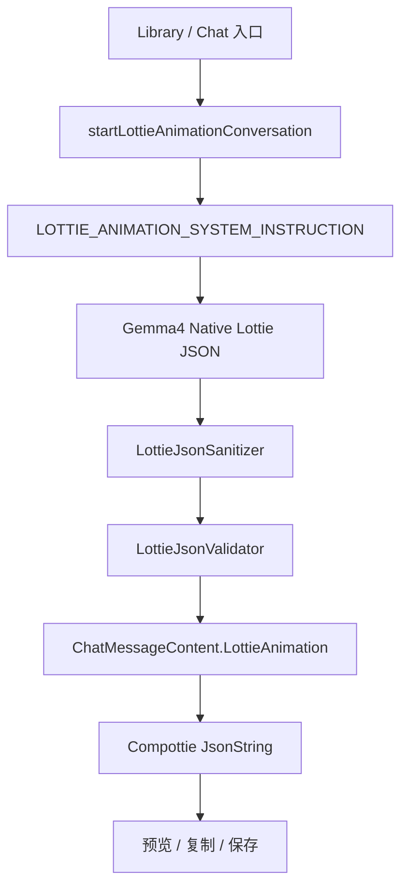

# Gemma4 Native Lottie JSON 与 Compottie 渲染路线

> 日期: 2026-07-28
> 最新更新: 2026-08-09 (v1.4.0 移除本地 Lottie 模板生产)
> 范围: `ChatViewModel` 专用会话入口、Native Lottie JSON 解析、Compottie 本地渲染、复制与保存
> 状态: Native JSON 直出路线落地
> 关联文档: `docs/specs/lottie-animation-prompt-spec.md`、`docs/agents/data-model.md`

## 1. 目标

Gemma4 4B 直接生成完整的 Native Lottie JSON。客户端不再根据 `kind`、`style`、`seed` 或关键词选择动画模板，也不使用数学公式补造图层。这样模型输出的几何、颜色、关键帧和动画时序就是最终动画的唯一来源。

客户端只承担四项职责:

1. 清洗模型常见的 JSON 格式错误。
2. 拒绝外部资源、脚本、表达式、3D 和超限图层。
3. 从已验证 JSON 提取标题、画布、FPS、时长和循环元数据。
4. 将同一份 JSON 交给 Compottie 预览、复制和保存。

## 2. 处理流程



## 3. 输出协议

模型必须输出一个 JSON object，根对象至少包含:

```json
{
  "v": "5.7.4",
  "fr": 30,
  "ip": 0,
  "op": 60,
  "w": 240,
  "h": 240,
  "nm": "Breathing Circle",
  "ddd": 0,
  "assets": [],
  "layers": []
}
```

推荐模型从一个 `ty=4` shape layer、一个 primitive、一个 fill/stroke 和一个动画属性开始。完整字段含义、最小可运行示例和时序规则维护在 `docs/specs/lottie-animation-prompt-spec.md`，system instruction 与该文档保持一致。

禁止模型输出:

- `lottie_animation_spec` intent envelope。
- URL、文件路径、图片、字体、base64、`.lottie` ZIP 和外部 assets。
- text layers、scripts、HTML、CSS、expressions、masks、effects 和 3D layers。
- Markdown、注释、尾随逗号或 JSON 外解释文本。

## 4. Native Lottie 参数边界

### 4.1 根对象

- `fr` 推荐 30 或 60。
- `ip` / `op` 使用帧而不是毫秒，时长为 `(op - ip) / fr` 秒。
- `w` / `h` 推荐 240，实际应保持在 64..512。
- `ddd` 必须为 0，`assets` 必须为空数组。
- `layers` 非空，最多 32 层，按 painter's order 排列。

### 4.2 图层与形状

- `ty=4` 表示 2D shape layer。
- `ks.o` 是 0..100 的 opacity，`ks.r` 是 degrees，`ks.p` 是绝对位置，`ks.a` 是 anchor，`ks.s` 是百分比缩放。
- Shape group 的 `it` 使用 `el`、`rc`、`sh`、`fl`、`st`、`tm` 和最后的 `tr`。
- 颜色使用归一化 RGBA，例如 `#1FA6F2` 约为 `[0.12,0.65,0.95,1]`。
- Trim Path 的 `e` 从 0 到 100 表示路径绘制过程。

### 4.3 关键帧

- 静态属性: `{ "a": 0, "k": value }`。
- 动画属性: `{ "a": 1, "k": [keyframes] }`。
- `t` 是绝对帧号，`s` 是段起始值，`e` 是段结束值，标量使用单元素数组。
- 毫秒到帧: `round(milliseconds * fr / 1000)`，并限制在 layer 的 `ip..op` 内。
- 循环动画必须首尾状态一致；单次动画必须以稳定、可读的姿态结束。

## 5. Parser 边界

`LottieAnimationSpecParser.kt` 因历史文件名保留 `Spec` 名称，但实际只解析 Native Lottie JSON:

| 组件 | 职责 |
| --- | --- |
| `LottieJsonSanitizer` | 修复模型生成的括号、数字、颜色、尺寸、scale、opacity 和嵌套 shape 格式问题。 |
| `LottieAnimationSpecParser` | 对 sanitizer 输出做 JSON object 解析并提取渲染元数据；不生成图层。 |
| `LottieJsonValidator` | 校验大小、layers、layer type、3D 标志、assets 和危险字段/值。 |
| `LottieMessageParser` | 将成功结果包装为 `ChatMessageContent.LottieAnimation`，失败时保留原始 payload。 |

Parser 不负责:

- 反序列化 `LottieAnimationSpec`。
- 根据 `kind/style` 选择模板。
- 根据 `seed/intensity/staggerMs` 计算几何。
- 生成、替换或补齐缺失的动画图层。

## 6. 数据与渲染

- `ChatMessageContent.LottieAnimation.json` 保存 sanitizer/validator 处理后的 Native Lottie JSON。
- `sourceSpecJson` 字段因现有持久化兼容暂时保留，但内容是模型原始 Native JSON，不再表示 Spec envelope。
- 不新增 Room schema；JSON 保持文本持久化，不写入 `.lottie` ZIP、外部 URL 或 blob。
- Compottie 使用 `LottieCompositionSpec.JsonString` 加载同一份 `json`。
- 复制和保存操作复制/保存 Native Lottie JSON，不存在“原始 Spec”和“生成 JSON”两个不同协议。

## 7. 失败策略

- JSON 为空、不可解析或没有 `layers`/`v`: `unexpected_content_type` 或 `invalid_lottie_json`。
- 旧 `lottie_animation_spec` envelope: `unexpected_content_type`。
- 外部资源、危险字段、3D、空 layers、超过 32 层或超过 256 KiB: 返回稳定的 `Unsupported.reason`。
- sanitizer 之后仍无法通过 validator: 保留原始 response，不影响会话历史。
- Compottie 解析失败: UI 显示渲染失败，同时保留可复制的 Native JSON。

## 8. 验证标准

- Gemma4 输出最小单圆形 Native JSON 可以被 parser 解析并交给 Compottie。
- 旧 `lottie_animation_spec` 不会再触发本地动画生产，而是被拒绝。
- 原生 JSON 的 malformed repair 测试继续通过。
- 同一份 Native JSON 在解析、持久化恢复和复制保存路径中保持语义一致。

## 9. 实施记录

### 2026-08-09 v1.4.0

- 重构 `ChatViewModel.LOTTIE_ANIMATION_SYSTEM_INSTRUCTION`，加入最小可运行示例、字段字典、关键帧语法和动画编排步骤。
- 删除 `LottieJsonBuilder` 及所有 `kind/style/seed` 本地模板和数学几何生产逻辑。
- 删除未使用的 `LottieAnimationSpec` 意图数据模型。
- 更新 Native JSON parser、消息错误码、测试与数据边界文档。
