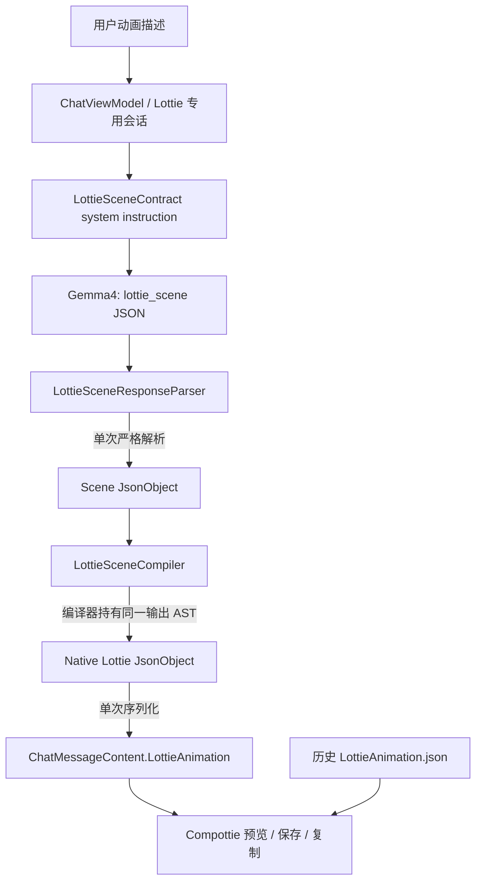

# Gemma4 4B Scene Plan 与 Compottie 渲染路线

> 日期：2026-07-28
> 最新更新：2026-08-24（v2.1.0，场景专用单次解析与闭集编译）
> 范围：Lottie 专用会话、Gemma4 4B 输出协议、Native Lottie 编译、Compottie 渲染
> 状态：已落地
> 关联文档：`docs/specs/lottie-animation-prompt-spec.md`、`docs/agents/data-model.md`

## 1. 问题与决策

Gemma4 4B 可以稳定完成“对象—外观—运动”的短链推理，但不适合同时维护 Bodymovin 的
根对象、图层、组、图元、颜料、变换和关键帧包装。v2.0 已将模型输出改为浅层
`lottie_scene`，由客户端编译器负责全部 Bodymovin 结构。

协议切换后，运行时仍保留了 1395 行 Native Lottie sanitizer 和通用 validator。即使输入是
完全合法的 `lottie_scene`，旧路线仍会执行多轮正则扫描、4 次 JSON AST 解析、2 次 UTF-8
`ByteArray` 分配和重复递归遍历；失败时还会为了读取 `declaredType` 再执行一次完整清洗与解析。
这些工作只服务于模型不再生成的 malformed Native Lottie，已经不属于当前热路径。

v2.1 采用以下决策：

1. 模型响应边界只接受 `lottie_scene` v1，不再猜测或修复 Native Bodymovin。
2. 使用场景专用解析器完成限长、轻量对象提取和唯一一次严格 JSON 解析。
3. 编译器直接返回内存中的 `JsonObject`；元数据从该对象读取，最后只序列化一次。
4. 安全边界由闭集编译保证：未知输入字段没有输出映射，因此无需递归扫描或二次验证编译器
   自己构造的 AST。
5. 已持久化的标准 Native Lottie 直接渲染，不重新进入模型响应解析路线。

该方案仍不引入 `kind/style/seed` 固定模板。模型决定图元、坐标、尺寸、颜色、路径顶点和
运动轨；编译器只做确定性映射、单位转换和边界归一化。

## 2. 总体流程



## 3. 组件职责

| 组件 | 单一职责 |
| --- | --- |
| `LottieSceneContract` | 定义 `lottie_scene` v1 字段和面向 4B 的短链提示词。 |
| `ChatViewModel` | 为 Lottie 模式加载当前协议、隔离会话并应用低随机度采样。 |
| `ContextStrategy` | 为短场景 JSON 预留 1536 tokens。 |
| `LottieSceneResponseParser` | 无分配限长、对象提取、一次严格解析、类型路由和结果元数据封装。 |
| `LottieSceneCompiler` | 把受限对象图确定性编译为编译器自有的 Bodymovin `JsonObject`。 |
| `LottieMessageParser` | 成功时封装动画；失败时直接使用异常携带的类型与 reason，保留原始 payload。 |

删除的 `LottieJsonSanitizer`、`LottieAnimationSpecParser` 和 `LottieJsonValidator` 不再属于运行时
架构。它们的历史行为可从 Git 记录和旧 Changelog 追溯，不保留空壳或兼容代理。

## 4. 场景协议边界

根对象使用 `type/schemaVersion/title/duration/loop/objects`。对象支持四类通用图元：

- `ellipse`：椭圆、圆、粒子、水滴等；
- `rect`：卡片、条、方块及圆角矩形；
- `star`：星形和闪光；
- `path`：开放描边或闭合多边形。

运动轨只有 `position/scale/rotation/opacity/trim`，时间统一为 0..1。模型不进行 FPS、毫秒、
帧号换算，也不输出 `a/k/s/e`。完整字段定义见 Prompt Specification。

## 5. 热路径与分配模型

### v2.0 旧路线

```text
response
  → 多轮 Regex/String replace
  → sanitizer 输入 parse
  → parser 再 parse
  → compiler serialize
  → validator parse + 递归扫描
  → metadata parse
  → final JSON
```

### v2.1 当前路线

```text
response
  → UTF-8 限长（常规短响应 O(1) 快速通过，无 ByteArray）
  → clean object 零复制 fast path / 包裹响应单次括号扫描
  → 唯一一次输入 parse
  → compiler-owned output JsonObject
  → 唯一一次输出 serialize
```

解析失败时不再调用 `declaredType(response)` 重跑管线。对于已成功解析但类型不匹配的对象，
`LottieParseException` 直接携带 `declaredType`；语法无效时使用当前协议类型 `lottie_scene`。

## 6. 编译与安全不变量

1. 画布固定 240×240、30 FPS、2D、空 `assets`。
2. 每个有效 object 对应一个 `ty=4` shape layer 和唯一正整数 `ind`。
3. 每层拥有完整 `o/r/p/a/s` 变换；每组拥有 geometry、fill/stroke 和 group transform。
4. 时间轨排序、去重、补边界并转换为绝对帧；每段 `e` 取下一关键帧 `s`。
5. 整个场景静止时，只为第一个对象增加 96%→104%→96% 呼吸脉冲。
6. 输入限制为 256 KiB；对象不超过 12、每轨不超过 8 行、路径不超过 32 个顶点，名称和标题
   也有长度上限，因此编译输出大小由结构上界约束。
7. 编译器只读取已知数值、颜色、几何和运动字段。未知 `assets/layers/script/URL` 等字段会被
   丢弃，无法进入输出；对编译器自有 AST 再做通用 Native 安全扫描没有新增信任价值。
8. Compact ellipse 与 path/trim 输出必须由 `LottieComposition.parse` 实际验收。

## 7. 兼容与持久化

`ChatMessageContent.LottieAnimation.json` 是已编译的 Native Lottie，也是预览、复制和保存的
唯一渲染数据。历史记录中的该字段保持有效，不需要数据库迁移，也不会重新经过 response
parser。`sourceSpecJson` 仅保留当时的模型原始响应用于审计，不在恢复会话时重新编译。

打开旧 Lottie 会话时，`ChatViewModel` 会迁移到当前 `lottie_scene` prompt。因此下一次生成不
依赖旧 Native 指令。若模型仍返回 Native Lottie 或 malformed JSON，则明确返回
`unexpected_content_type` 或 `invalid_lottie_json`，不再用猜测性修复掩盖协议漂移。

旧 `lottie_animation_spec` 也返回 `unexpected_content_type`，但其声明类型会保留在
`ChatMessageContent.Unsupported` 中。

## 8. 性能验证

`LottiePipelinePerformanceProbeTest` 在独立的 Desktop/JBR 21 定向测试进程中先预热 40 次，再
连续处理 500 次相同的双水滴场景。2026-08-24 同机、同负载结果：

| 路线 | 500 次耗时 | 相对结果 |
| --- | ---: | ---: |
| v2.0 sanitizer/parser/validator | 1393 ms | 1.0× |
| v2.1 single-parse/closed-compile | 116–171 ms | 8.1–12.0× |

总耗时下降约 87.7%–91.7%。该数字用于同机前后对比，不作为不同设备上的绝对 SLA。结构性回归审查
应关注：输入解析是否仍为 1 次、输出解析是否为 0 次、输出序列化是否为 1 次，以及主路径是否
重新引入 Regex 或 Native AST 递归修复。

## 9. 失败策略

- 无 JSON object、语法损坏或括号未闭合：`invalid_lottie_json`。
- 响应超过 256 KiB UTF-8：`lottie_json_too_large`。
- 非 `lottie_scene`：`unexpected_content_type`。
- scene 无 objects：`empty_lottie_scene_objects`。
- schema 不兼容：`unsupported_schema_version`。
- objects 超上限：`lottie_scene_object_count_too_large`。

失败消息保留原始响应，不让单次动画生成破坏会话持久化。

## 10. 验证标准

- `:composeApp:compileKotlinDesktop` 通过。
- `LottieMessageParserTest` 覆盖 ellipse、path/trim、静态 fallback、围栏提取、闭集字段投影、
  schema/类型/语法失败，并让成功结果通过 `LottieComposition.parse`。
- `LottiePipelinePerformanceProbeTest` 可重复输出同负载耗时。
- `ContextStrategyTest` 继续锁定 Lottie 的 1536-token 输出预算与 tool-call constraint。

## 11. 版本记录

### 2026-08-24 v2.1.0

- 删除 1395 行 Native sanitizer 以及旧通用 parser/validator。
- 新增 `LottieSceneResponseParser`，实现单次解析、零复制 clean fast path、无分配 UTF-8 限长和
  单次序列化。
- 将外部内容安全边界改为闭集编译，并明确历史已持久化 JSON 与新模型响应的不同路径。
- 同机定向测试进程的 500 次性能探针由 1393 ms 降至 116–171 ms。

### 2026-08-24 v2.0.0

- 用 `lottie_scene` 通用对象图替换 Gemma4 Native Lottie 直出主路线。
- 新增 `LottieSceneContract` 与 `LottieSceneCompiler`。
- 新增模式级低随机度采样、短输出预算和旧会话 prompt 迁移。
- 暂时保留历史 Native JSON sanitizer；该兼容响应路线已在 v2.1 删除。

### 2026-08-10 v1.6.0

- Native Lottie 直出路线增强 malformed path、transform 和 drawable 校验。
- 该版本仅作为历史实现记录，不再属于当前模型响应协议。
