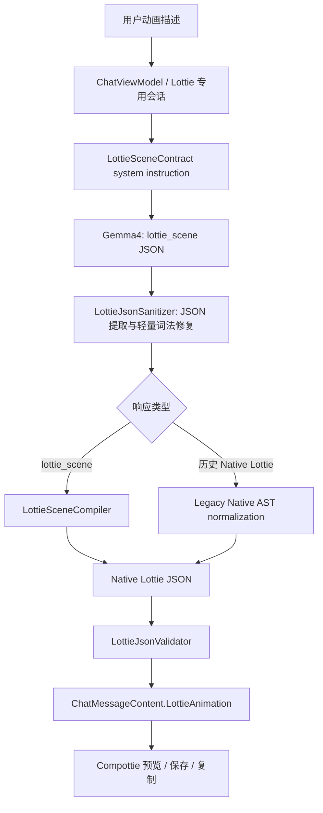

# Gemma4 4B Scene Plan 与 Compottie 渲染路线

> 日期：2026-07-28
> 最新更新：2026-08-24（v2.0.0，改为 `lottie_scene` 通用场景编译路线）
> 范围：Lottie 专用会话、Gemma4 4B 输出协议、Native Lottie 编译、兼容清洗、Compottie 渲染
> 状态：已落地
> 关联文档：`docs/specs/lottie-animation-prompt-spec.md`、`docs/agents/data-model.md`

## 1. 问题与决策

Gemma4 4B 可以稳定完成“对象—外观—运动”的短链推理，但不适合同时维护 Bodymovin 的
根对象、图层、组、图元、颜料、变换和关键帧包装。已观察到的失败不是单一语法错误，而是
多个抽象层同时坍塌：

- shape layer 的数值 `ty=4` 被写成组类型字符串 `"gr"`；
- `ks` 缺少 `a/r/s` 等标准属性包装；
- `shapes.it` 中对象缺少图元/填充 `ty`；
- 颜色混用 0..1、0..255，甚至输出 `2555`；
- 关键帧把当前 `s` 原样复制给 `e`，导致动画不插值；
- 根对象遗漏画布和名称。

继续扩写 Native Lottie 提示词只会增加 4B 的工作记忆负担，sanitizer 也无法在没有语义证据
时可靠猜出任意缺失图层。因此 v2 采用两阶段架构：模型只规划一个浅层、可读的场景对象图；
客户端通用编译器负责全部 Bodymovin 结构。

该方案不恢复旧的 `kind/style/seed` 固定模板。模型仍然决定每个图元、坐标、尺寸、颜色、
路径顶点和运动轨；编译器只做一一映射、单位转换和边界归一化。

## 2. 总体流程

## 3. 组件职责

| 组件 | 单一职责 |
| --- | --- |
| `LottieSceneContract` | 定义 `lottie_scene` v1 字段和面向 4B 的短链提示词。 |
| `ChatViewModel` | 为 Lottie 模式加载当前协议、隔离会话并应用低随机度采样。 |
| `ContextStrategy` | 为短场景 JSON 预留 1536 tokens，不再沿用 Native AST 的 4096 tokens。 |
| `LottieSceneCompiler` | 把对象图、颜色与归一化运动轨确定性编译成 Bodymovin。 |
| `LottieJsonSanitizer` | 提取/修复 JSON，并兼容历史 malformed Native Lottie；不参与新场景语义规划。 |
| `LottieJsonValidator` | 对最终 Native JSON 执行资源、大小、图层、2D 与 drawable 安全校验。 |
| `LottieMessageParser` | 成功时封装动画内容，失败时保留原始 payload 和稳定 reason。 |

## 4. 场景协议边界

根对象只包含 `type/schemaVersion/title/duration/loop/objects`。对象支持四类通用图元：

- `ellipse`：椭圆、圆、粒子、水滴等；
- `rect`：卡片、条、方块及圆角矩形；
- `star`：星形和闪光；
- `path`：开放描边或闭合多边形。

运动轨只有 `position/scale/rotation/opacity/trim`，时间统一为 0..1。模型不再进行 FPS、
毫秒、帧号换算，也不再输出 `a/k/s/e`。完整字段定义见 Prompt Specification。

## 5. 编译不变量

编译器输出必须满足以下不变量：

1. 画布固定 240×240、30 FPS、2D、空 assets。
2. 每个有效 scene object 对应一个 `ty=4` shape layer 和唯一正整数 `ind`。
3. 每层拥有完整 `o/r/p/a/s` 变换；矢量统一补足 Lottie 所需维度。
4. 每组至少包含一个 geometry、一个 fill/stroke 和末尾 group transform。
5. 时间轨按进度排序、去重、补边界，再转换为绝对帧。
6. 每段 `e` 取下一关键帧 `s`，从结构上保证插值连续。
7. 整个场景静止时只为第一个对象增加轻微呼吸脉冲，避免返回不可感知的“动画”。
8. 最终输出必须再次通过 `LottieJsonValidator`，编译成功不等于自动信任。

## 6. Gemma4 推理策略

System instruction 只要求模型按以下顺序静默规划：

1. 选择 1..6 个可见对象；
2. 给每个对象确定简单几何、颜色和初始位置；
3. 给每个对象选择一个清晰运动并写 2..5 个归一化轨点。

Lottie 模式把采样限制为 `temperature<=0.25`、`topP<=0.9`、`topK<=20`，减少字段名漂移和
尾部扩写。Structured conversation 仍然按请求隔离，历史模型响应不回灌 KV。打开旧 Lottie
会话时强制迁移到当前 prompt，避免持久化的 v1 Native 指令继续生效。

## 7. 兼容路径

已有 `ChatMessageContent.LottieAnimation.json` 本身就是 Native Lottie，不需要迁移数据库。
`sourceSpecJson` 继续保存模型原始响应：新消息通常是 `lottie_scene`，历史消息可能是 Native
Lottie。复制/保存仍针对已编译并验证的 `json`，因此 UI 与持久化结构无变化。

Native 兼容 sanitizer 保留既有修复，并新增有证据的匿名图元恢复：当 group 明确提供尺寸，
匿名子属性明确提供三/四通道颜色时，可恢复为 ellipse + fill。缺少这些证据时不会凭关键词
发明主体，最终仍由 drawable validator 拒绝。

旧 `lottie_animation_spec` 固定意图协议继续返回 `unexpected_content_type`。

## 8. 失败策略

- 无 JSON object：`invalid_lottie_json`。
- 非 `lottie_scene` 且非 Native Lottie：`unexpected_content_type`。
- scene 无 objects：`empty_lottie_scene_objects`。
- schema 不兼容：`unsupported_schema_version`。
- scene 含 Native AST、外部资源或可执行内容：`forbidden_lottie_scene_content`。
- 最终 Native JSON 无 geometry + paint：`empty_lottie_drawable_content`。
- 其余大小、资源和图层越界沿用 `LottieJsonValidator` 的稳定 reason。

失败消息保留原始响应，不让单次动画生成破坏会话持久化。

## 9. 验证标准

- `:composeApp:compileKotlinDesktop` 通过。
- `LottieMessageParserTest` 中 compact ellipse 场景和 path/trim 场景均能通过
  `LottieComposition.parse`。
- 用户报告的匿名水滴 Native JSON 经兼容路径后可被 Compottie 解析。
- 既有 malformed Native JSON、路径修复、空 drawable 拒绝测试继续通过。
- `ContextStrategyTest` 锁定 Lottie 的 1536-token 输出预算和关闭 tool-call constraint。

## 10. 版本记录

### 2026-08-24 v2.0.0

- 用 `lottie_scene` 通用对象图替换 Gemma4 Native Lottie 直出主路线。
- 新增 `LottieSceneContract` 与 `LottieSceneCompiler`。
- 新增模式级低随机度采样、短输出预算和旧会话 prompt 迁移。
- 保留历史 Native JSON，并增强匿名图元与缺失动画标志修复。

### 2026-08-10 v1.6.0

- Native Lottie 直出路线增强 malformed path、transform 和 drawable 校验。
- 该版本现仅作为历史兼容输入，不再作为模型生成协议。
